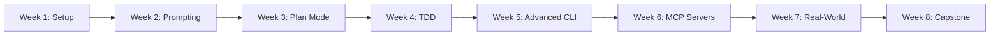

# RealManage AI 101: Claude Code 🚀

Welcome to the comprehensive Claude Code training course designed specifically for RealManage teams. This self-paced course will transform how you write code, automate tasks, and solve complex problems using AI assistance.

## 📚 Course Overview

**Duration:** 8 weeks (self-paced, ~2 hours per week)  
**Level:** Beginner to Intermediate  
**Format:** Self-study with optional group sessions  
**Prerequisites:** Basic programming knowledge, access to a terminal

## 🎯 What You'll Learn

By completing this course, you'll be able to:
- ✅ Set up and configure Claude Code for your development environment
- ✅ Write effective prompts that get high-quality code responses
- ✅ Use Plan Mode for complex architectural decisions
- ✅ Implement Test-Driven Development with AI assistance
- ✅ Build custom MCP servers for RealManage-specific integrations
- ✅ Automate repetitive HOA management tasks
- ✅ Create production-ready code with proper testing and documentation

## 🗺️ Learning Path



## 📁 Course Structure

```
ai-101-claude-code/
├── README.md                    # You are here
├── Course-Content.md            # Full 8-week curriculum
├── CLAUDE.md                    # AI context for this course
├── setup/                       # Setup guides and scripts
│   ├── windows-wsl-setup.md    
│   ├── mac-setup.md            
│   ├── linux-setup.md          
│   └── verify-setup.sh         
├── exercises/                   # Hands-on practice
│   ├── week1-basics/           
│   ├── week2-prompting/        
│   ├── week3-planning/         
│   ├── week4-tdd/              
│   ├── week5-advanced/         
│   ├── week6-mcp/              
│   ├── week7-realworld/        
│   └── week8-capstone/         
├── examples/                    # RealManage-specific examples
│   ├── hoa-violations/         
│   ├── payment-processing/     
│   ├── resident-communications/
│   └── report-generation/      
└── resources/                   # Additional materials
    ├── prompt-library.md        
    ├── common-patterns.md       
    ├── troubleshooting.md       
    └── quick-reference.md       
```

## 🚀 Quick Start

### Option 1: Self-Paced Learning (Recommended)

1. **Start with Setup** → [Week 1 Setup Guide](./setup/README.md)
2. **Follow the Course** → [Full Course Content](./Course-Content.md)
3. **Practice with Exercises** → [Hands-on Exercises](./exercises/README.md)
4. **Reference Examples** → [RealManage Examples](./examples/README.md)
5. **Get Help** → Join `#dx-training` on Slack

### Option 2: Cohort Learning

Join a scheduled cohort for group learning:
- Weekly 2-hour sessions
- Live demonstrations
- Peer programming
- Direct Q&A with instructors

Check `#dx-training` for upcoming cohorts.

## 📋 Prerequisites Checklist

Before starting, ensure you have:

- [ ] **Development Environment**
  - [ ] WSL2 installed (Windows users) or macOS/Linux
  - [ ] Node.js 18+ and npm 10+
  - [ ] Git configured with GitLab access
  - [ ] VS Code, Cursor, or similar IDE

- [ ] **Accounts & Access**
  - [ ] Anthropic account (for Claude Code)
  - [ ] GitLab account with RealManage access
  - [ ] Slack access to `#dx-training` channel

- [ ] **Basic Knowledge**
  - [ ] Comfortable with command line
  - [ ] Basic Git operations
  - [ ] Any programming language (Python, JavaScript, or TypeScript preferred)

## 📖 How to Use This Course

### For Self-Paced Learners

1. **Block Time**: Dedicate 2-3 hours per week
2. **Setup First**: Complete Week 1 setup before proceeding
3. **Practice Daily**: Apply concepts to your current work
4. **Document Progress**: Keep notes in your personal CLAUDE.md
5. **Share Wins**: Post successes in `#dx-wins`

### For Team Leads

1. **Form Study Groups**: 3-5 people work well
2. **Schedule Check-ins**: Weekly 30-min progress reviews
3. **Create Challenges**: Propose team-specific exercises
4. **Share Results**: Demo completed projects to the broader team

## 🎓 Certification Path

Complete all 8 weeks and submit a capstone project to earn:
- **RealManage AI Practitioner** certificate
- Recognition in Engineering All-Hands
- Badge for your GitLab profile
- Priority access to advanced courses

## 🤝 Getting Help

### Immediate Help
- **Quick Questions**: `#dx-training` on Slack
- **Bugs/Issues**: [GitLab Issues](https://gitlab.com/therealmanage/tools/dx/dx-training/-/issues)
- **Office Hours**: Thursdays 2-3 PM CT

### Self-Help Resources
- [Troubleshooting Guide](./resources/troubleshooting.md)
- [Quick Reference](./resources/quick-reference.md)
- [Common Patterns](./resources/common-patterns.md)
- [Prompt Library](./resources/prompt-library.md)

## 📊 Track Your Progress

Use this checklist to track your journey:

- [ ] Week 1: Setup & Orientation
- [ ] Week 2: Prompting Foundations
- [ ] Week 3: Plan Mode & Exploration
- [ ] Week 4: Test-Driven Development
- [ ] Week 5: Advanced CLI Features
- [ ] Week 6: MCP Servers & Integrations
- [ ] Week 7: Real-World Scenarios
- [ ] Week 8: Capstone Project

## 🌟 Success Stories

> "Claude Code reduced our code review time by 40% and caught edge cases we typically miss." - *Engineering Team Lead*

> "I automated our monthly HOA violation reports in Week 6. What used to take 4 hours now takes 15 minutes." - *Product Manager*

> "The TDD module changed how I approach all development, not just with AI." - *Senior Developer*

## 🚦 Ready to Start?

Choose your path:

<div align="center">

### [📚 Start Self-Paced Learning](./Course-Content.md)
*Work through the course at your own speed*

### [🏃 Jump to Week 1 Setup](./setup/README.md)
*Get your environment ready first*

### [👥 Join Next Cohort](https://calendar.realmanage.com/dx-training)
*Learn with a group*

</div>

---

**Questions?** Reach out in `#dx-training` or email dx-team@realmanage.com

**Course Version:** 1.0.0 | **Last Updated:** January 2024

*"The future of coding isn't replacing developers—it's amplifying their capabilities."* - DX Team