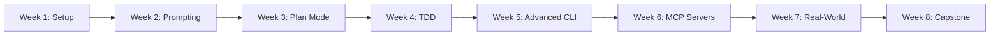

# RealManage AI 101: Claude Code 🚀

Welcome to the comprehensive Claude Code training course designed specifically for RealManage teams. This self-paced course will transform how you write code, automate tasks, and solve complex problems using AI assistance.

## 📚 Course Overview

**Duration:** 8 weeks (self-paced, ~2 hours per week)  
**Level:** Beginner to Intermediate  
**Format:** Self-study with optional group sessions  
**Goal:** Progressively immerse RealManage's cross-functional team in Claude Code, building practical skills while leaving time for normal work

## 🎯 What You'll Learn

By completing this course, you'll be able to:
- ✅ Set up and configure Claude Code for your development environment
- ✅ Write effective prompts that get high-quality code responses
- ✅ Use Plan Mode for complex architectural decisions
- ✅ Implement Test-Driven Development with AI assistance (95-100% coverage)
- ✅ Build custom MCP servers for RealManage-specific integrations
- ✅ Automate repetitive HOA management tasks
- ✅ Create production-ready C# and Angular code with proper testing

## 🗺️ Learning Path



## 📁 Course Structure

```
ai-101-claude-code/
├── .vscode/                     # VS Code workspace settings
│   ├── extensions.json         # Recommended extensions
│   └── settings.json           # Project settings
├── exercises/                   # Shared practice materials
│   ├── prompts/
│   │   └── hoa-templates.md
│   └── claude-md-template.md
├── resources/                   # Reference materials
│   ├── prompts/
│   │   └── getting-started.md
│   ├── cli-commands.md         # Command cheatsheet
│   ├── common-patterns.md
│   ├── prompt-library.md
│   ├── quick-reference.md
│   └── troubleshooting.md
├── sessions/                    # Weekly lessons with examples
│   ├── week-1/                 # Setup & Orientation
│   │   ├── example/            # Reference CLI app (in git)
│   │   ├── README.md           # Full lesson plan
│   │   └── setup-verification.md
│   ├── week-2/                 # Prompting Foundations
│   │   └── README.md
│   ├── week-3/                 # Plan Mode
│   │   └── README.md
│   ├── week-4/                 # TDD
│   │   └── README.md
│   ├── week-5/                 # Advanced CLI
│   │   └── README.md
│   ├── week-6/                 # MCP Servers
│   │   └── README.md
│   ├── week-7/                 # Real-World
│   │   └── README.md
│   └── week-8/                 # Capstone
│       └── README.md
├── CLAUDE.md                    # AI context for this course
└── README.md                    # You are here
```

## 🚀 Quick Start

### Option 1: Self-Paced Learning (Recommended)

1. **Complete Prerequisites** → Check the list below
2. **Start Week 1** → [Setup & Orientation](./sessions/week-1/README.md)
3. **Practice in Sandbox** → Copy examples to sandbox for hands-on work
4. **Track Progress** → Use the checklist at the bottom
5. **Get Help** → Join `#dx-training` on Slack

### 💡 Sandbox Workflow

Each week with code examples follows this pattern:
```bash
# Navigate to the week's folder
cd sessions/week-1

# Copy the example to create your personal sandbox
cp -r example sandbox

# Enter your sandbox
cd sandbox

# Start Claude Code in your sandbox
claude
```

**Why this approach?**
- ✅ **Safe experimentation** - Break things without fear
- ✅ **Clean git history** - Your work won't be committed
- ✅ **Easy reset** - Just delete sandbox and copy again
- ✅ **Reference available** - Original example stays pristine

### Option 2: Cohort Learning

Join a scheduled cohort for group learning:
- Weekly 2-hour sessions
- Live demonstrations
- Peer programming
- Direct Q&A with instructors

Check `#dx-training` for upcoming cohorts.

## 📋 Prerequisites Checklist

Before starting, ensure you have:

- [ ] **Development Environment**
  - [ ] Windows: Git Bash or WSL2 installed
  - [ ] Mac/Linux: Terminal ready
  - [ ] .NET 9 SDK ([Download](https://dotnet.microsoft.com/download/dotnet/9.0))
  - [ ] Node.js 22 LTS via nvm
  - [ ] npm 10+
  - [ ] Git configured with GitLab access
  - [ ] IDE: VS Code, Windsurf, or Cursor with extensions (see `.vscode/extensions.json`)

- [ ] **Accounts & Access**
  - [ ] Anthropic account or API Key (for Claude Code)
  - [ ] GitLab account with RealManage access
  - [ ] Slack access to `#dx-training` channel

- [ ] **Basic Knowledge**
  - [ ] Comfortable with command line
  - [ ] Basic Git operations
  - [ ] C# and/or Angular experience
  - [ ] Understanding of TDD principles

---

# 📖 8-Week Training Curriculum

## Week 1: Setup & Orientation

### Objectives
- Install and authenticate the `claude-code` CLI
- Understand how Claude Code works beyond simple code completion
- Navigate the CLI with essential commands
- Create and manage CLAUDE.md memory files
- Identify 3+ use cases for daily work

### Agenda (2 hrs)

#### 1. Installation & Authentication (20 min)
- **Windows users**: Use Git Bash (recommended) or WSL2
- System requirements: Node 22 LTS, npm 10+
- Install via `npm install -g @anthropic-ai/claude-code`
- Complete OAuth authentication
- Verify with `claude doctor` command

#### 2. Tour of the CLI (20 min)
- Start a session with `claude` command
- Essential slash commands (`/help`, `/cost`, `/memory`)
- Understanding token usage and costs
- Sonnet 4 pricing: $0.003/1K input, $0.015/1K output

#### 3. First Queries (30 min)
- Copy the [Week 1 Example](./sessions/week-1/example/) to your sandbox
- Explore a modern C# CLI app with intentional bugs
- Ask questions about top-level programs, records, and patterns
- Fix the compound interest bug in CalculateFine

#### 4. CLAUDE.md and Memory (40 min)
- Understand the hierarchical memory system
- Project memory (`./CLAUDE.md`) vs user memory (`~/.claude/CLAUDE.md`)
- Quick setup: Use `#` shortcut or `/memory` command
- Create RealManage-specific templates with TDD requirements

#### 5. Reflection (10 min)
- Discuss takeaways and real task applications
- Share one "aha moment" in Slack

**[→ Full Week 1 Lesson](./sessions/week-1/README.md)**

---

## Week 2: Prompting Foundations

### Objectives
- Learn how to craft clear prompts that get high-quality responses
- Practice using system prompts, examples, and XML tags for structure
- Build a prompt library for RealManage use cases

### Agenda (2 hrs)

#### 1. Prompt Engineering Primer (25 min)
- [Prompt Engineering Overview](https://docs.anthropic.com/en/docs/build-with-claude/prompt-engineering/overview)
- Claude 4 specific techniques
- Being explicit and providing context
- System prompts and role assignment

#### 2. Structured Prompts (15 min)
- Using XML tags for clarity
- Markdown sections to organize prompts
- Reducing ambiguity through structure

#### 3. Hands-On Prompt Workshop (60 min)
Break into pairs for RealManage scenarios:
- Summarizing board meeting transcripts
- Drafting homeowner violation notices
- Generating financial reports with 95% test coverage
- Creating Angular components with OnPush change detection

#### 4. Build a Prompt Library (15 min)
- Collect best prompts in shared CLAUDE.md
- Add variables and placeholders for dynamic content

#### 5. Feedback & Next Steps (10 min)
- Discuss what patterns worked
- Plan daily task integration

**[→ Week 2 Coming Soon](./sessions/week-2/README.md)**

---

## Week 3: Plan Mode & Exploration

### Objectives
- Understand Claude's Plan Mode for breaking down complex tasks
- Practice the "Explore → Plan → Code → Commit" workflow
- Apply extended thinking modes to architectural decisions

### Agenda (2 hrs)

#### 1. Plan Mode Overview (20 min)
- Extended thinking for complex tasks
- Different depths: "think," "think hard," "ultra think"
- Workflow: Explore → Plan → Code → Commit

#### 2. Exploration in Practice (25 min)
- Read files, mockups, and URLs without writing code
- Ask architecture and dependency questions
- Chain of thought techniques
- Long context best practices

#### 3. Hands-On Plan Mode (45 min)
Small group exercise: "Add HOA dues dashboard widget"
- Use Explore to inspect existing Angular components
- Ask Claude to "think hard" about state management
- Create step-by-step implementation plan
- Consider RxJS vs signals architecture

#### 4. Optional Implementation (20 min)
- Begin coding from the plan
- Use `/permissions` to control file edits
- Review changes before accepting

#### 5. Debrief (10 min)
- Capture plans in CLAUDE.md for reference

**[→ Week 3 Coming Soon](./sessions/week-3/README.md)**

---

## Week 4: Test-Driven Development with Claude

### Objectives
- Learn how to pair TDD with Claude for reliable code
- Master the Red-Green-Refactor cycle with AI
- Apply TDD to RealManage's 95-100% coverage requirement

### Agenda (2 hrs)

#### 1. TDD Introduction (20 min)
- Why TDD works with AI: prevents hallucinations
- [Claude Code Best Practices - TDD](https://www.anthropic.com/engineering/claude-code-best-practices)
- Red-Green-Refactor cycle
- Benefits for HOA management systems

#### 2. Writing Tests with Claude (20 min)
- Ask Claude to write xUnit tests from specifications
- Ensure tests cover edge cases
- C# examples with FluentAssertions and Moq
- Angular testing with Jasmine/Karma

#### 3. Iterative Coding (40 min)
- Run tests to confirm failure (red phase)
- Write code to pass tests (green phase)
- Refactor while keeping tests green
- Never let Claude modify the tests

#### 4. Hands-On Exercise (30 min)
RealManage examples:
- Late fee calculation with compound interest
- Violation escalation workflows
- Payment processing with audit trails
- Board meeting report generation

#### 5. Reflection (10 min)
- Compare TDD with AI vs traditional TDD
- Plan integration into daily workflow

**[→ Week 4 Coming Soon](./sessions/week-4/README.md)**

---

## Week 5: Advanced CLI Features & Multi-Claude Workflows

### Objectives
- Customize the CLI with themes, permissions and slash commands
- Learn multi-Claude workflows for parallel tasks
- Understand safe YOLO mode and when to use it

### Agenda (2 hrs)

#### 1. Customization & Permissions (30 min)
- Settings management via `/config`
- Control permissions with `/permissions`
- Security best practices for HOA data
- Share settings via `.claude/settings.json`

#### 2. Custom Slash Commands (20 min)
- Creating custom commands in `.claude/commands/`
- Pass arguments with `$ARGUMENTS`
- RealManage-specific commands

#### 3. Advanced Workflows (40 min)
- Safe YOLO mode for repetitive tasks
- Multiple Claude instances with `git worktrees`
- Collaborative workflows: code writer + reviewer
- Parallel C# API and Angular UI development

#### 4. Hands-On Practice (20 min)
- Create custom slash command for HOA violations
- Experiment with multi-instance review workflow

#### 5. Discussion (10 min)
- Share automation opportunities

**[→ Week 5 Coming Soon](./sessions/week-5/README.md)**

---

## Week 6: MCP Servers & External Integrations

### Objectives
- Understand MCP servers and how they extend Claude Code
- Build a simple server for HOA-specific tools
- Integrate with RealManage's existing systems

### Agenda (2 hrs)

#### 1. MCP Overview (20 min)
- [MCP Integration Guide](https://docs.anthropic.com/en/docs/claude-code/mcp)
- Understanding the protocol
- Benefits: automation, flexibility, integrations

#### 2. Examples & Use Cases (15 min)
- HOA-specific: violation tracking, dues monitoring
- Financial analysis and reporting
- Azure Service Bus integration
- SQL Server data access

#### 3. Server Quickstart (35 min)
- Build with MCP SDK
- Implement `get_hoa_fees(account_id)` example
- Connect to SQL Server via Entity Framework
- Test locally with mock API

#### 4. Connecting to Claude (30 min)
- Configure `.claude/.mcp.json`
- Call custom tools from Claude
- Logging best practices

#### 5. Reflection & Brainstorming (20 min)
- Propose custom MCP server projects
- Plan Azure integrations

**[→ Week 6 Coming Soon](./sessions/week-6/README.md)**

---

## Week 7: Real-World Scenarios & Continuous Improvement

### Objectives
- Apply learned skills to cross-functional RealManage tasks
- Show how Claude Code assists different roles
- Emphasize continuous improvement

### Agenda (2 hrs)

#### 1. Cross-Functional Use Cases (30 min)
- **Support staff:** Summarize tickets, draft responses
- **Project managers:** Generate release notes, plan sprints
- **Product managers:** Synthesize feedback into features
- **Engineers:** Automate refactoring, generate docs

#### 2. Group Exercise (60 min)
Form cross-functional teams:
- Apply Plan Mode, TDD, MCP tools
- Build real RealManage features
- Focus on 95% test coverage

#### 3. Iterate & Improve (20 min)
- Refine prompts, CLAUDE.md, tests
- Monitor usage and costs
- Setup GitHub Actions automation

#### 4. Debrief (10 min)
- Share lessons learned

**[→ Week 7 Coming Soon](./sessions/week-7/README.md)**

---

## Week 8: Capstone Hackerspace & Future Roadmap

### Objectives
- Consolidate all skills in a larger project
- Encourage creativity and innovation
- Identify follow-up projects

### Agenda (2 hrs)

#### 1. Project Selection (10 min)
Teams propose RealManage solutions:
- Automate HOA violation escalation
- Create self-service knowledge base
- Integrate with external CRM systems
- Build financial forecasting tools

#### 2. Building (90 min)
- Apply all learned skills
- Document in CLAUDE.md
- Write tests throughout (95% coverage)
- Use C#/.NET 9 and Angular 17

#### 3. Demo & Celebration (20 min)
- Team demonstrations
- Discuss production readiness
- Future learning paths

**[→ Week 8 Coming Soon](./sessions/week-8/README.md)**

---

## 📊 Track Your Progress

Use this checklist to track your journey:

- [ ] Week 1: Setup & Orientation ✅
- [ ] Week 2: Prompting Foundations
- [ ] Week 3: Plan Mode & Exploration
- [ ] Week 4: Test-Driven Development
- [ ] Week 5: Advanced CLI Features
- [ ] Week 6: MCP Servers & Integrations
- [ ] Week 7: Real-World Scenarios
- [ ] Week 8: Capstone Project

## 🎓 Certification Path

Complete all 8 weeks and submit a capstone project to earn:
- **RealManage AI Practitioner** certificate
- Recognition in Engineering All-Hands
- Badge for your GitLab profile
- Priority access to advanced courses

## 🤝 Getting Help

### Immediate Help
- **Quick Questions**: `#dx-training` on Slack
- **Bugs/Issues**: [GitLab Issues](https://gitlab.com/therealmanage/tools/dx/dx-training/-/issues)
- **Office Hours**: Thursdays 2-3 PM CT

### Self-Help Resources
- [CLI Commands Cheatsheet](./resources/cli-commands.md)
- [Troubleshooting Guide](./resources/troubleshooting.md)
- [Prompt Library](./resources/prompt-library.md)
- [Quick Reference](./resources/quick-reference.md)

## 📚 Follow-Up and Resources

### Official Documentation
- [Anthropic Claude Code Docs](https://docs.anthropic.com/en/docs/claude-code)
- [Prompt Engineering Guide](https://docs.anthropic.com/en/docs/build-with-claude/prompt-engineering)
- [Claude Code Best Practices](https://www.anthropic.com/engineering/claude-code-best-practices)

### Internal Support
- Create `#claude-hackerspace` Slack channel
- Schedule weekly office hours
- Share prompt libraries and CLAUDE.md templates

### Continued Learning
- Advanced topics: RAG, vector databases, agent frameworks
- Compare with other tools: Copilot, ChatGPT, Cursor
- Explore automation opportunities

### Safety & Ethics
- Maintain human oversight
- Validate AI outputs before production use
- Protect sensitive HOA and resident data
- Follow SOC 2 Type II requirements

## 🌟 Success Stories

> "Claude Code reduced our code review time by 40% and caught edge cases we typically miss." - *Engineering Team Lead*

> "I automated our monthly HOA violation reports in Week 6. What used to take 4 hours now takes 15 minutes." - *Product Manager*

> "The TDD module changed how I approach all development, not just with AI." - *Senior Developer*

## 📊 Success Metrics

You're ready for the next week when you can:
- Start Claude Code in any project directory
- Use basic slash commands without looking them up
- Write a CLAUDE.md that provides context
- Generate working C# code with 95% test coverage
- Estimate token costs for your queries

## 🚦 Red Flags

Seek help if:
- Claude Code won't start after installation
- Authentication keeps failing
- Generated code has obvious errors
- Costs seem unusually high (>$5/hour)
- Test coverage drops below 95%

---

## References

### Official Anthropic Documentation
1. **Claude Code Documentation** - https://docs.anthropic.com/en/docs/claude-code
2. **Prompt Engineering Guide** - https://docs.anthropic.com/en/docs/build-with-claude/prompt-engineering
3. **Model Context Protocol** - https://docs.anthropic.com/en/docs/mcp
4. **Claude Code Best Practices** - https://www.anthropic.com/engineering/claude-code-best-practices

### Test-Driven Development Resources
5. **Claude Code and TDD** - The New Stack - https://thenewstack.io/claude-code-and-the-art-of-test-driven-development/
6. **CLAUDE MD TDD Wiki** - https://github.com/ruvnet/claude-flow/wiki/CLAUDE-MD-TDD
7. **TDD Guard for Claude Code** - https://github.com/nizos/tdd-guard
8. **E2E Testing with Claude Code** - https://shipyard.build/blog/e2e-testing-claude-code/

### Community Resources
9. **Awesome Claude Code** - https://github.com/hesreallyhim/awesome-claude-code
10. **Claude Code Beginners Guide** - Geeky Gadgets - https://www.geeky-gadgets.com/claude-code-beginners-guide-2025/
11. **MCP Servers Guide** - Geeky Gadgets - https://www.geeky-gadgets.com/mcp-servers-claude-code-integration/
12. **MCP Quickstart** - https://modelcontextprotocol.io/quickstart/server

### Additional Learning
13. **Test-driven development with AI** - Builder.io - https://www.builder.io/blog/test-driven-development-ai
14. **How Anthropic Teams Use Claude Code** - https://www.anthropic.com/news/how-anthropic-teams-use-claude-code
15. **Claude Directory Guide** - https://htdocs.dev/posts/introducing-claude-your-ultimate-directory-for-claude-code-excellence/

---

**Questions?** Reach out in `#dx-training` or email dx-team@realmanage.com

**Course Version:** 1.0.0 | **Last Updated:** January 2025

*"The future of coding isn't replacing developers—it's amplifying their capabilities with 95% test coverage."* - DX Team