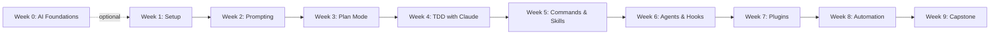

# RealManage AI 101: Claude Code 🚀

Welcome to the comprehensive Claude Code training course designed specifically for RealManage teams. This self-paced course will transform how you write code, automate tasks, and solve complex problems using AI assistance.

## 🎯 Choose Your Path

**All roles follow the same weekly curriculum** with role-specific exercises. Each week has a unified README everyone follows, plus `tracks/` folders with focused exercises for each persona.

| Your Role | Quick Start | Weekly Structure |
| --------- | ----------- | ---------------- |
| Developer | [Developer Guide](resources/quick-start-developer.md) | Main README + `tracks/developer.md` exercises |
| QA Engineer | [QA Guide](resources/quick-start-qa.md) | Main README + `tracks/qa.md` exercises |
| Product Manager | [PM Guide](resources/quick-start-pm.md) | Main README + `tracks/pm.md` exercises |
| Support | [Support Guide](resources/quick-start-support.md) | Main README + `tracks/support.md` exercises |
| **Experienced Dev** | See below | Fast-track through key weeks |

### ⚡ Experienced Developer Fast Track (~4 hours)

Already comfortable with AI tools? Skip the basics:

1. **[Decision Trees](resources/decision-trees.md)** (30 min) - When to use what
2. **[Week 3: Code Review](sessions/week-3/README.md)** (1 hr) - Plan Mode + CodeReviewPro exercise
3. **[Week 4: TDD with Claude](sessions/week-4/README.md)** (1 hr) - Tests-first workflow
4. **[Week 8: Automation](sessions/week-8/README.md)** (1 hr) - Context management, anti-patterns, role-specific automation
5. **Capstone** (as needed) - Validate your skills

*Sam-approved for senior devs who've used Copilot and want to see what's different.*

**Quick Resources:** [Glossary](resources/glossary.md) | [Decision Trees](resources/decision-trees.md) | [Troubleshooting](resources/troubleshooting.md)

---

## 📚 Course Overview

- **Duration:** 9 weeks plus optional Week 0 primer (self-paced, ~2 hours per week)
- **Level:** Beginner to Intermediate
- **Format:** Self-study with optional group sessions
- **Goal:** Progressively immerse RealManage's cross-functional team in Claude Code, building practical skills while leaving time for normal work

## 🎯 What You'll Learn

By completing this course, you'll be able to:

- ✅ Set up and configure Claude Code for your development environment
- ✅ Write effective prompts that get high-quality code responses
- ✅ Use Plan Mode for complex architectural decisions
- ✅ Implement Test-Driven Development with AI assistance (80-90% coverage)
- ✅ Build custom skills and use sub-agents for parallel work
- ✅ Automate repetitive HOA management tasks
- ✅ Create production-ready C# and Angular code with proper testing

## 🗺️ Learning Path



## 📁 Course Structure

```text
ai-101-claude-code/
├── .vscode/                     # VS Code workspace settings
│   ├── extensions.json         # Recommended extensions
│   └── settings.json           # Project settings
├── resources/                   # Reference materials & templates
│   ├── prompts/
│   │   ├── getting-started.md
│   │   └── hoa-templates.md
│   ├── cli-commands.md         # Command cheatsheet
│   ├── claude-md-minimal.md    # Minimal CLAUDE.md starter
│   ├── claude-md-template.md   # Full CLAUDE.md template
│   ├── common-patterns.md
│   ├── decision-trees.md       # When to use what
│   ├── glossary.md             # Term definitions
│   ├── prompt-library.md
│   ├── quick-reference.md
│   ├── quick-start-developer.md
│   ├── quick-start-pm.md
│   ├── quick-start-qa.md
│   └── troubleshooting.md
├── sessions/                    # Weekly lessons with examples
│   ├── week-0/                 # AI Foundations (optional)
│   │   └── README.md
│   ├── week-1/                 # Setup & Orientation
│   │   ├── README.md           # Unified lesson (everyone follows)
│   │   ├── examples/           # Reference projects (hoa-cli, support)
│   │   ├── tracks/             # Role-specific exercises
│   │   │   ├── developer.md
│   │   │   ├── qa.md
│   │   │   ├── pm.md
│   │   │   └── support.md
│   │   └── setup-verification.md
│   ├── week-2/                 # Prompting Foundations
│   │   ├── README.md
│   │   └── tracks/             # Role-specific exercises
│   ├── week-3/                 # Plan Mode
│   │   ├── README.md
│   │   └── tracks/
│   ├── week-4/ through week-9/ # Same pattern...
├── CLAUDE.md                    # AI context for this course
└── README.md                    # You are here
```

## 🚀 Quick Start

### Option 1: Self-Paced Learning (Recommended)

1. **Complete Prerequisites** → Check the list below
2. **Start Week 1** → [Setup & Orientation](./sessions/week-1/README.md)
3. **Practice in Sandbox** → Copy examples to sandbox for hands-on work
4. **Track Progress** → Use the checklist at the bottom
5. **Get Help** → Join `#ai-exchange` on Slack

### 💡 Sandbox Workflow

Each week with code examples follows this pattern:

```bash
# Navigate to the week's folder
cd sessions/week-1

# Copy the example to create your personal sandbox
cp -r examples sandbox

# Enter your sandbox
cd sandbox/<example-name>

# Start Claude Code in your sandbox
claude
```

**Why this approach?**

- ✅ **Safe experimentation** - Break things without fear
- ✅ **Clean git history** - Your work won't be committed
- ✅ **Easy reset** - Just delete sandbox and copy again
- ✅ **Reference available** - Original example stays pristine

### Option 2: Cohort Learning

Join a scheduled cohort for group learning:

- Weekly 2-hour sessions
- Live demonstrations
- Peer programming
- Direct Q&A with instructors

Check `#ai-exchange` for upcoming cohorts.

## 📋 Prerequisites Checklist

Before starting, ensure you have:

- [ ] **Development Environment**
  - [ ] Windows: [Git for Windows](https://git-scm.com/downloads/win) installed (required for native Claude Code)
  - [ ] Mac (13.0+) / Linux / WSL2: Terminal ready
  - [ ] Claude Code installed via native installer (see [Week 1 QUICKSTART](./sessions/week-1/QUICKSTART.md))
  - [ ] .NET 10 SDK ([Download](https://dotnet.microsoft.com/download/dotnet/10.0)) — requires local admin
  - [ ] Node.js 22 LTS via nvm *(for Angular exercises only — not required for Claude Code)*
  - [ ] Git configured with GitLab access
  - [ ] IDE: VS Code, Windsurf, or Cursor with extensions (see `.vscode/extensions.json`)

- [ ] **Accounts & Access**
  - [ ] Anthropic account or API Key (for Claude Code)
  - [ ] GitLab account with RealManage access
  - [ ] Slack access to `#ai-exchange` channel

- [ ] **Basic Knowledge**
  - [ ] Comfortable with command line
  - [ ] Basic Git operations
  - [ ] C# and/or Angular experience
  - [ ] Understanding of TDD principles

### QA Engineer Prerequisites

If following the QA Track, you need less setup:

- [ ] Claude Code installed (see Week 1 QUICKSTART)
- [ ] Basic terminal familiarity (can run commands)
- [ ] .NET SDK (for running tests, not writing production code)
- [ ] Slack access to `#ai-exchange`
- [ ] *Skip:* Deep C# experience not required—focus on test frameworks (xUnit)

### PM / Support Prerequisites

If following the PM or Support Track:

- [ ] Claude Code installed (see Week 1 QUICKSTART)
- [ ] Can open terminal and run basic commands
- [ ] Slack access to `#ai-exchange`
- [ ] *Skip:* .NET SDK, npm, Angular, and testing tools not required

---

## 📖 Training Curriculum

| Week | Topic | What You'll Learn | Time | Session |
| ---- | ----- | ----------------- | ---- | ------- |
| 0 | AI Foundations *(optional)* | LLMs, agentic engineering, AI landscape | 1.5 hrs | [Start →](./sessions/week-0/README.md) |
| 1 | Setup & Orientation | Install CLI, tour commands, CLAUDE.md memory | 2 hrs | [Start →](./sessions/week-1/README.md) |
| 2 | Prompting Foundations | Clear communication, prompt styles, test coverage | 2 hrs | [Start →](./sessions/week-2/README.md) |
| 3 | Planning & Code Review | Plan Mode, Step/Auto/Plan, Opus for review | 2.5 hrs | [Start →](./sessions/week-3/README.md) |
| 4 | Test-Driven Development | Red-Green-Refactor, xUnit, FluentAssertions, Moq | 2 hrs | [Start →](./sessions/week-4/README.md) |
| 5 | Commands & Skills | Custom slash commands, skills, YAML frontmatter | 2 hrs | [Start →](./sessions/week-5/README.md) |
| 6 | Agents & Hooks | Custom subagents, lifecycle hooks, SOC 2 audit | 2 hrs | [Start →](./sessions/week-6/README.md) |
| 7 | Plugins | Package skills + agents + hooks, marketplace | 2 hrs | [Start →](./sessions/week-7/README.md) |
| 8 | Real-World Automation | Context management, anti-patterns, role-specific tracks | 2 hrs | [Start →](./sessions/week-8/README.md) |
| 9 | Capstone Hackerspace | Consolidate all skills, team project, certification | 2 hrs | [Start →](./sessions/week-9/README.md) |

> Each session README is self-contained with objectives, exercises, and role-specific tracks. Click "Start" to dive in.

---

## 🎓 Certification Path

Complete all 9 weeks and submit a capstone project to earn:

- **RealManage AI Practitioner** certificate
- Recognition in Engineering All-Hands
- Badge for your GitLab profile
- Priority access to advanced courses

## 🤝 Getting Help

### Immediate Help

- **Quick Questions**: `#ai-exchange` on Slack
- **Bugs/Issues**: [GitLab Issues](https://gitlab.com/therealmanage/tools/dx/dx-training/-/issues)
- **Office Hours**: Thursdays 2-3 PM CT

### Self-Help Resources

- [Glossary](./resources/glossary.md) - Key terms and definitions
- [Quick Reference](./resources/quick-reference.md) - CLAUDE.md templates and shortcuts
- [Decision Trees](./resources/decision-trees.md) - When to use what
- [Common Patterns](./resources/common-patterns.md) - Code patterns and examples
- [CLI Commands Cheatsheet](./resources/cli-commands.md) - Essential commands at a glance
- [Troubleshooting Guide](./resources/troubleshooting.md) - Common issues and fixes
- [Prompt Library](./resources/prompt-library.md) - Reusable prompts for HOA tasks
- [Getting Help](./resources/getting-help.md) - Support channels and how to get assistance

## 📚 Follow-Up and Resources

### Official Documentation

- [Claude Code Docs](https://code.claude.com/docs/en/overview)
- [Prompt Engineering Guide](https://docs.anthropic.com/en/docs/build-with-claude/prompt-engineering/overview)
- [Claude Code Best Practices](https://www.anthropic.com/engineering/claude-code-best-practices)

### Internal Support

- Create `#claude-hackerspace` Slack channel
- Schedule weekly office hours
- Share prompt libraries and CLAUDE.md templates

### Continued Learning

- Advanced topics: RAG, vector databases, agent frameworks
- Compare with other tools: Copilot, ChatGPT, Cursor
- Explore automation opportunities

### Safety & Ethics

- Maintain human oversight
- Validate AI outputs before production use
- Protect sensitive HOA and resident data
- Follow SOC 2 Type II requirements

## 🌟 Success Stories

> "Claude Code reduced our code review time by 40% and caught edge cases we typically miss." - *Engineering Team Lead*

> "I automated our monthly HOA violation reports in Week 6. What used to take 4 hours now takes 15 minutes." - *Product Manager*

> "The TDD module changed how I approach all development, not just with AI." - *Senior Developer*

## 📊 Success Metrics

### Developer Track

You're ready for the next week when you can:

- Start Claude Code in any project directory
- Use basic slash commands without looking them up
- Write a CLAUDE.md that provides context
- Generate working C# code with 80-90% test coverage
- Manage context efficiently for optimal results

### QA Track

You've completed the QA track when you can:

- Generate comprehensive test suites for existing code
- Identify coverage gaps and write tests to fill them
- Use Claude to create test data and edge case scenarios
- Review and improve existing test quality
- Complete Option D capstone (Test Automation Suite)

### PM Track

You've completed the PM track when you can:

- Explain AI capabilities and limitations to stakeholders
- Write AI-ready feature specifications using the CLEAR framework
- Use Claude to refine requirements and generate user stories
- Understand developer conversations about Claude Code workflows
- Complete Option E capstone (PRD + User Stories)

## 🚦 Red Flags

Seek help if:

- Claude Code won't start after installation
- Authentication keeps failing
- Generated code has obvious errors
- Usage seems unusually high (check with `/usage` for session and weekly limits)
- Test coverage drops below 80% *(Developer/QA tracks)*

---

## References

### Official Anthropic Documentation

1. **Claude Code Documentation** - <https://code.claude.com/docs/en/overview>
2. **Prompt Engineering Guide** - <https://docs.anthropic.com/en/docs/build-with-claude/prompt-engineering/overview>
3. **Model Context Protocol** - <https://modelcontextprotocol.io/>
4. **Claude Code Best Practices** - <https://www.anthropic.com/engineering/claude-code-best-practices>

### Test-Driven Development Resources

1. **Claude Code and TDD** - The New Stack - <https://thenewstack.io/claude-code-and-the-art-of-test-driven-development/>
2. **CLAUDE MD TDD Wiki** - <https://github.com/ruvnet/claude-flow/wiki/CLAUDE-MD-TDD>
3. **TDD Guard for Claude Code** - <https://github.com/nizos/tdd-guard>
4. **E2E Testing with Claude Code** - <https://shipyard.build/blog/e2e-testing-claude-code/>

### Community Resources

1. **Awesome Claude Code** - <https://github.com/hesreallyhim/awesome-claude-code>
2. **Claude Code Beginners Guide** - Geeky Gadgets - <https://www.geeky-gadgets.com/claude-code-beginners-guide-2025/>
3. **MCP Servers Guide** - Geeky Gadgets - <https://www.geeky-gadgets.com/mcp-servers-claude-code-integration/>
4. **MCP Quickstart** - <https://modelcontextprotocol.io/quickstart/server>

### Additional Learning

1. **Test-driven development with AI** - Builder.io - <https://www.builder.io/blog/test-driven-development-ai>
2. **How Anthropic Teams Use Claude Code** - <https://www.anthropic.com/news/how-anthropic-teams-use-claude-code>
3. **Claude Directory Guide** - <https://htdocs.dev/posts/introducing-claude-your-ultimate-directory-for-claude-code-excellence/>

---

**Questions?** Reach out in `#ai-exchange`

*"The future of coding isn't replacing developers—it's amplifying their capabilities with 80-90% test coverage."* - DX Team
