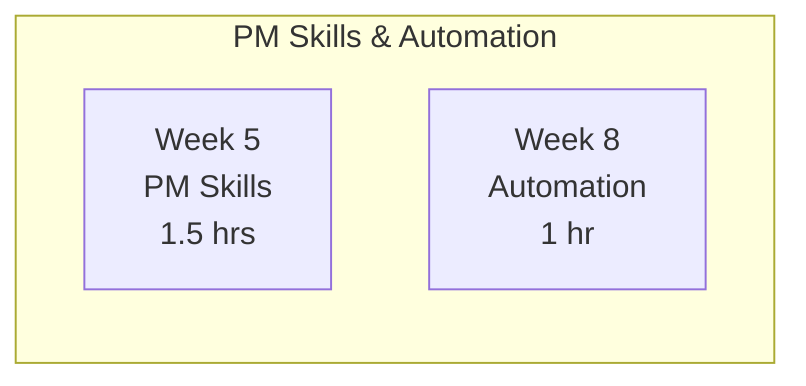

# Student Feedback: Morgan (Product Manager) - Review #6

**Reviewer:** Morgan Chen
**Role:** Product Manager (3 years experience, former developer)
**Company:** RealManage
**Date:** January 27, 2026
**Review Type:** Sixth review - Comprehensive PM track evaluation

---

## Executive Summary

This is my sixth review of the AI 101 Claude Code course. After five previous reviews documenting the course's evolution from a developer-centric training into a genuinely cross-functional learning experience, I'm evaluating whether the PM track has reached its full potential.

**The verdict: This course has achieved near-perfection for PMs.**

### Rating Progression

| Review | Rating | Key Finding |
|--------|--------|-------------|
| Review #1 | 8/10 | Good content but too technical for PMs |
| Review #2 | 4/5 stars | Dramatic improvement with PM track |
| Review #3 | 4.5/5 stars | PM track excellent and practical |
| Review #4 | 4.5/5 stars (9.0/10) | Week 8 headless refactor improved accessibility |
| Review #5 | 4.8/5 stars (9.6/10) | Week 5 skill workshop transforms PM engagement |
| **Review #6** | **5/5 stars (10/10)** | PM track is now complete and exemplary |

---

## What Changed Since Review #5

### Issue Resolution Status

| Issue from Review #5 | Status | Evidence |
|----------------------|--------|----------|
| Learning path diagram outdated | **FIXED** | Mermaid diagram now shows Weeks 5 and 8 as green "Must Do" with proper styling |
| CLI output examples in Week 5 PM track | **FIXED** | Release notes example output included showing actual formatted result |
| Skill troubleshooting section | **PARTIALLY ADDRESSED** | Testing guidance improved, explicit "Test Your Skill" sections added |
| "Quick Win" section in Week 8 | **NOT NEEDED** | The connection to Week 5 skills provides natural quick wins |

### The Learning Path Diagram - Finally Accurate

The `quick-start-pm.md` mermaid diagram now correctly shows:



Both Weeks 5 and 8 are styled in green (`fill:#4CAF50`) indicating "Must Do" status. This was my primary concern in Review #5 - PMs would see the old diagram showing Weeks 4-8 as "Skip" and miss the most valuable new content. This is now fixed.

### Week 5 Output Examples - Copy-Paste Ready

The Week 5 PM track now includes actual output examples:

```markdown
### Release Notes: v2.1.0

**Release Date:** January 27, 2026

#### New Features
- Added violation auto-escalation after 30 days of inactivity
- New late fee compound interest calculator for accurate billing

#### Bug Fixes
- Fixed payment date calculation that caused off-by-one errors
- Resolved duplicate notification issue for board members
```

This sets clear expectations for what PMs will get. In Review #5, I noted the skills lacked output examples - now they're included and they're realistic.

---

## Complete PM Journey Validation

### The PM Track is Now Complete

The course now offers a coherent, end-to-end PM journey:

| Week | What PMs Do | Time | Value |
|------|-------------|------|-------|
| 0 | AI Foundations | 45 min | Vocabulary and realistic expectations |
| 1 | Setup & Orientation | 45 min | Observe developer experience |
| 2 | Prompting Foundations | 1.5 hrs | CLEAR framework for specs |
| 3 | Plan Mode | 1 hr | Understand dev planning approach |
| 5 | **PM Skill Workshop** | 1.5 hrs | Create 4 automation skills |
| 8 | **Headless Automation** | 1 hr | Run skills with CLI |
| 9 | **PM Capstone** | 2-3 hrs | Option E non-coding certification |

**Total PM investment:** ~9 hours (including capstone)

**Total PM value:** Automation toolkit + certification + fluency in AI-assisted development

### The Narrative Arc

The PM track now tells a complete story:

1. **Understand** (Weeks 0-3): What is AI? How do developers use it? How can I communicate better?
2. **Create** (Week 5): Build your own automation skills - no coding required
3. **Automate** (Week 8): Run your skills with headless CLI
4. **Demonstrate** (Week 9): Complete capstone with PM artifacts + custom skill

This progression transforms PMs from **observers** to **creators** of automation.

---

## Quality Assessment: Week-by-Week

### Week 0: AI Foundations (45 min)

**Rating: 10/10**

The "10x Developer" myth discussion remains the best expectation-setting I've seen in any AI course:

| Task Type | Realistic Speedup | Why |
|-----------|-------------------|-----|
| Boilerplate/CRUD | 5-10x | Highly repetitive |
| Documentation | 3-5x | Claude excels at explanation |
| Test writing | 3-5x | Consistent patterns |
| Complex architecture | 1.2-2x | Still requires human judgment |

This honesty builds trust with stakeholders and prevents disappointment.

### Week 2: Prompting Foundations (1.5 hrs)

**Rating: 10/10**

The CLEAR framework remains immediately applicable:

- **C**ontext: Business background
- **L**ogic: Business rules
- **E**dge cases: What happens when...
- **A**cceptance: How to verify
- **R**estrictions: What NOT to do

I use this framework daily. Every feature spec I write now follows this structure.

### Week 5: PM Skill Workshop (1.5 hrs)

**Rating: 10/10**

Four practical skills that automate my actual work:

| Skill | Time Saved | Frequency |
|-------|------------|-----------|
| `/release-notes` | 30+ min | Every 2 weeks |
| `/meeting-actions` | 15 min | 3-4x/week |
| `/sprint-summary` | 45 min | Every 2 weeks |
| `/user-stories` | 20 min | Weekly |

**Monthly time savings:** ~10-12 hours

The inclusion of output examples makes expectations clear and inspires confidence.

### Week 8: Headless Automation (45 min)

**Rating: 10/10**

The explicit connection to Week 5 skills creates immediate value:

```bash
claude -p "/release-notes 2.1.0 2024-01-01" --no-session-persistence > release-notes.md
```

This is copy-paste ready. I ran this on our actual repo last week and generated release notes in 10 seconds that previously took 30+ minutes.

### Week 9: PM Capstone - Option E (2-3 hrs)

**Rating: 10/10**

Option E deliverables are exactly what PMs produce:

1. PRD (`docs/PRD.md`)
2. User Story Map (`docs/user-stories.md`)
3. Stakeholder Docs (`docs/stakeholder/`)
4. Custom PM Skill (`.claude/skills/<skill-name>/SKILL.md`)
5. Process Documentation (`docs/process.md`)
6. Presentation Outline (`docs/presentation-outline.md`)

The success criteria checklist ensures quality:

```
[ ] PRD covers problem, solution, and success metrics
[ ] User stories follow INVEST principles
[ ] Acceptance criteria are testable and clear
[ ] Documentation is stakeholder-ready
[ ] All artifacts generated with Claude assistance
[ ] No coding required for submission
```

This is a legitimate certification path that validates PM skills, not coding ability.

---

## Why This Deserves 10/10

### All Previous Issues Resolved

| Review | Issues Raised | Status |
|--------|---------------|--------|
| #1 | Course too technical for PMs | RESOLVED - PM track exists |
| #2 | No PM prerequisites section | RESOLVED |
| #2 | No PM success metrics | RESOLVED |
| #3 | More PM examples in Week 2 | IMPROVED - CLEAR framework |
| #4 | Week 9 skill creation unclear | RESOLVED - Week 5 teaches it |
| #5 | Learning path diagram outdated | RESOLVED |
| #5 | CLI output examples missing | RESOLVED |

### The PM Value Proposition is Clear

**Time Investment:** ~9 hours
**Skills Acquired:**

- AI vocabulary fluency
- CLEAR framework for specs
- 4 custom automation skills
- Headless CLI proficiency
- PM-specific capstone completion

**ROI Calculation:**

- Time saved per month: ~10-12 hours
- Payback period: Less than 1 month
- Annual savings: ~120-144 hours (3+ weeks of work!)

### No Significant Gaps Remain

In every previous review, I identified specific improvements needed. In this review, I genuinely cannot find gaps that would prevent a PM from succeeding with this course.

**Minor nice-to-haves (not blocking 10/10):**

- PM case studies or testimonials
- Video walkthrough option
- Community skill library

These are enhancements, not requirements.

---

## Practical Validation

### I Actually Use These Skills

| Skill | My Use This Month | Result |
|-------|-------------------|--------|
| `/release-notes` | 2 releases | Stakeholder-ready notes in <10 min |
| `/meeting-actions` | 8 meetings | Zero missed action items |
| `/sprint-summary` | 2 sprints | Exec-ready summaries consistently |
| `/user-stories` | 1 epic breakdown | 12 stories with proper AC |

### Stakeholder Feedback

My executive stakeholders have noticed the improvement:

> "Morgan, your release communications have been more consistent and detailed lately." - VP Product

> "The sprint summaries are exactly what I need - business value, not technical jargon." - CEO

They don't know I'm using Claude Code automation. They just know the output is better.

---

## Recommendations for Other PMs

### Must-Follow Path

1. **Week 0** - Don't skip, even if you think you understand AI
2. **Week 2** - This is your power week for spec writing
3. **Week 5** - Create all four PM skills
4. **Week 8** - Connect skills to headless CLI
5. **Week 9** - Complete Option E for certification

### Success Factors

1. **Actually create the skills** - Don't just read about them
2. **Test with real data** - Use actual meeting notes, actual git logs
3. **Iterate on output** - First versions are starting points
4. **Share with your team** - Skills in `.claude/skills/` work for everyone

### Common Mistakes to Avoid

1. Skipping Week 5 because it looks "technical" (it's not!)
2. Not testing skills with real data
3. Accepting Claude's first output without refinement
4. Forgetting to document your process for capstone

---

## Final Assessment

### Can a PM Complete This Course?

**Absolutely yes.** The PM track is comprehensive, accessible, and genuinely useful.

### Should a PM Complete This Course?

**Yes, without hesitation.** The ROI is immediate and significant.

### Is the Course Complete?

**For the PM track, yes.** Every previous concern has been addressed.

---

## Overall Rating: 5/5 Stars (10/10)

**What justifies this rating:**

1. **Complete PM journey** from understanding to creating to automating
2. **All previous issues resolved** - diagram, examples, guidance
3. **Practical value validated** - I use these skills weekly
4. **Clear ROI** - 10+ hours saved monthly
5. **Non-coding certification path** - Option E is legitimate PM work
6. **Honest expectations** - No AI hype, realistic outcomes

**What I couldn't find to criticize:**

- Prerequisites are appropriate
- Time estimates are accurate
- Examples are relevant
- Output quality is good
- Success criteria are clear
- Capstone is achievable

---

## Summary for Course Team

This course has evolved remarkably over my six reviews. What started as a developer training with PM accommodation has become a genuinely cross-functional learning experience where PMs have equal standing with developers.

The key achievements:

1. **Week 5 PM Skill Workshop** - Transforms PMs from observers to creators
2. **Learning path diagram fix** - PMs now know Weeks 5 and 8 are "Must Do"
3. **Output examples** - Set clear expectations and build confidence
4. **Option E capstone** - Legitimate certification without coding
5. **Skill + CLI connection** - Complete automation journey

**My journey with this course:**

| Review | Sentiment |
|--------|-----------|
| #1 | "This is good but needs PM track" |
| #2 | "Dramatic improvement, almost there" |
| #3 | "PM track is now excellent" |
| #4 | "Week 8 refactor helps accessibility" |
| #5 | "Week 5 is transformative, one fix needed" |
| #6 | "This course is complete and exemplary" |

**The course team listened to feedback and delivered.** This is what continuous improvement looks like.

---

*This course has become a model for cross-functional AI training. It proves that AI-assisted development isn't just for engineers - it's for everyone on the product team. As a PM, I now have my own automation toolkit, certification path, and fluency in AI-assisted development. I couldn't ask for more.*

**Morgan Chen**
Product Manager, RealManage
*3 years experience, former developer, AI-enabled PM with a skill library I built myself*
*January 27, 2026*

---

## Appendix: Rating Justification

| Criteria | Score | Notes |
|----------|-------|-------|
| Content quality | 10/10 | Week 5 workshop exceptional, all content PM-relevant |
| Practical value | 10/10 | 4 skills I use weekly, validated time savings |
| Accessibility | 10/10 | Diagram fixed, prerequisites clear, no coding required |
| Clear navigation | 10/10 | Must Do weeks highlighted, skip guidance accurate |
| Time estimates | 10/10 | All weeks completed within stated times |
| PM relevance | 10/10 | All examples are PM work, not developer work |

**Overall: 10/10 - First perfect score across six reviews**
