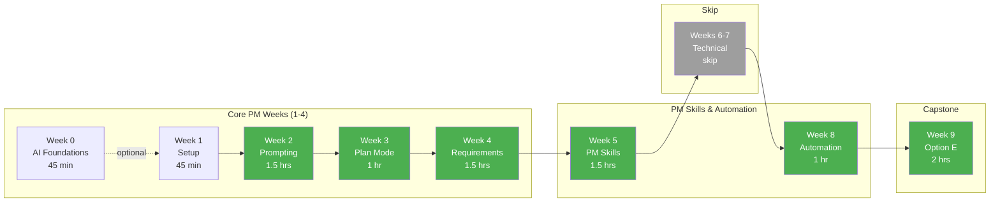

# Quick Start: Product Manager Track

You define what gets built. You want Claude Code to help you communicate with developers and understand AI-assisted development. Here's your focused path.

**Estimated Time:** 6-8 hours total

---

## Your Learning Path



**Your Focus Weeks (green):** Weeks 2, 3, 5, 8, and 9 are your power weeks. Week 5 teaches PM skill creation, Week 8 shows how to use them with automation.

### What You'll Cover vs Skip

| Week | Topic | PM Priority | Notes |
|------|-------|-------------|-------|
| 0 | AI Foundations | Recommended | Understand the technology |
| 1 | Setup & Orientation | Must Do | Observe, don't need to master |
| 2 | Prompting Foundations | Must Do | Learn to write good specs |
| 3 | Plan Mode | Must Do | Understand dev planning |
| 4 | Writing Testable Requirements | Must Do | Given/When/Then, edge cases |
| 5 | Commands & Skills | Must Do | Create PM automation skills |
| 6 | Agents & Hooks | Skip | Developer-focused |
| 7 | Plugins | Skip | Developer-focused |
| 8 | Real-World Workflows | Must Do | Use skills with headless CLI |
| 9 | Capstone | Must Do | PM-specific option available |

---

## Week-by-Week Focus

### Week 0: AI Foundations (45 min) - Recommended

**Goal:** Speak the language of AI development.

Key concepts you need:

- **LLM (Large Language Model):** The AI type Claude uses
- **Tokens:** Basic units of text that affect context limits
- **Context window:** How much the AI can "remember"
- **Hallucination:** Why AI output must be verified (critical for requirements)
- **Agentic:** AI that can take actions, not just answer questions

**Why this matters for PMs:** You'll make better decisions about when to use AI and set realistic expectations with stakeholders.

---

### Week 1: Setup & Orientation (45 min)

**Goal:** Understand the developer experience, not master the tool.

**What to do:**

- [ ] Install Claude Code (follow the guide)
- [ ] Have one conversation with Claude
- [ ] Observe a developer using it (pair session recommended)

**What to skip:** Deep configuration, CLAUDE.md customization.

**PM Insight:** Notice how developers interact with Claude. This helps you:

- Estimate AI-assisted development more accurately
- Write requirements that work well with AI workflows
- Understand what makes a "good" vs "bad" spec for AI consumption

---

### Week 2: Prompting Foundations (1.5 hours)

**Goal:** Learn to write specifications that translate well to AI-assisted development.

**This is your power week.** Good prompts = good specs = good products.

**The CLEAR Framework for PM Specs:**

| Element | What It Means | Example |
|---------|---------------|---------|
| **C**ontext | Business background | "Our HOA clients need to track violations..." |
| **L**ogic | Business rules | "Late fees compound monthly at 10%..." |
| **E**dge cases | What happens when... | "If payment is partial, apply to oldest first..." |
| **A**cceptance | How to verify | "User can see payment history sorted by date..." |
| **R**estrictions | What NOT to do | "Never auto-delete violations, only soft-delete..." |

**Spec Template for AI-Ready Requirements:**

```markdown
## Feature: [Name]

### Context
[Why this feature exists. Business driver.]

### User Story
As a [role], I want to [action], so that [benefit].

### Business Rules
1. [Rule 1 - be specific]
2. [Rule 2 - include numbers/thresholds]
3. [Rule 3 - describe edge cases]

### Acceptance Criteria
- [ ] [Verifiable criterion 1]
- [ ] [Verifiable criterion 2]
- [ ] [Verifiable criterion 3]

### Out of Scope
- [What this feature does NOT include]
- [Explicit non-goals]

### Questions for Dev
- [Ambiguity 1]
- [Technical decision needed]
```

**Exercise:** Take an existing spec and rewrite it using this template.

---

### Week 3: Plan Mode & Code Review (1 hour)

**Goal:** Understand how developers plan AI-assisted implementations.

**Key Concept:** When developers use "plan mode" (`Shift+Tab`), Claude creates an implementation plan before writing code. As a PM, you can:

1. **Review plans** - Ask to see Claude's implementation plan before coding starts
2. **Validate approach** - Check if the plan addresses your requirements
3. **Catch issues early** - Identify missing requirements before code is written

**PM Use Case - Requirement Validation:**

```
Given this feature spec:
[PASTE YOUR SPEC]

Create an implementation plan that covers:
1. What components need to change
2. What tests will verify the requirements
3. What edge cases are handled

Don't write code yet, just the plan.
```

Review the plan with your developer. Does it cover your requirements?

---

### Week 4: Writing Testable Requirements (1.5 hours) ⭐

**Goal:** Write requirements that developers can directly translate into tests.

**This week has a dedicated [PM Track](../sessions/week-4/tracks/pm.md).**

**What You'll Learn:**

- Given/When/Then format for acceptance criteria
- What makes requirements "TDD-ready"
- Edge case discovery with Claude
- Collaborating with QA and developers on test scenarios

**Why This Matters:**

Your requirements feed developer TDD. Bad requirements = developers guess what to test = bugs.
Good requirements = developers know exactly what to test = quality software.

**Exercise:** Write Given/When/Then acceptance criteria for violation escalation:

```gherkin
Given a violation was created 30 days ago
And the violation status is "Open"
When the escalation job runs
Then the violation status changes to "Warning Sent"
And a warning letter is generated
```

**Checkpoint:** Can a developer write a test directly from your acceptance criteria?

---

### Week 5: Commands & Skills (1.5 hours) ⭐

**Goal:** Create your own PM automation skills.

This is a power week for PMs! You'll create skills that automate your actual work:

- [ ] `/release-notes` - Git history → stakeholder summary
- [ ] `/meeting-actions` - Meeting notes → Jira-ready tasks
- [ ] `/sprint-summary` - Sprint data → exec report
- [ ] `/user-stories` - Epics → broken-down stories

**No coding required** - Skills are just structured markdown files.

**Checkpoint:** Can you run `/release-notes` on a project and get stakeholder-friendly output?

---

### Weeks 6-7: Skim/Skip

- **Week 6 (Agents & Hooks):** Skim for compliance concepts
- **Week 7 (Plugins):** Skip - developer-focused

---

### Week 8: Real-World Workflows (1 hour)

**Goal:** Use your Week 5 skills with headless automation.

**Key Concepts:**

- **Headless Automation:** Running Claude CLI non-interactively with `-p` flag
- **Skills + CLI:** Use your PM skills in batch automation
- **PM-Relevant Automation:** Release notes, meeting summaries, sprint reports

**Checkpoint:** Can you run your `/release-notes` skill from the command line and save output to a file?

```bash
claude -p "/release-notes 2.1.0 2024-01-01" --no-session-persistence > release-notes.md
```

---

### Week 9: Capstone (3-4 hours)

**Goal:** Create PM-focused deliverables using Claude.

**PM Capstone Option: Product Design & Documentation**

Build a complete product specification package:

1. **Feature Specification Document**
   - Use Claude to help refine requirements
   - Generate edge case analysis
   - Create acceptance criteria

2. **User Story Mapping**
   - Use Claude to break epics into stories
   - Generate story dependencies
   - Identify MVP vs future scope

3. **Stakeholder Documentation**
   - Executive summary
   - Technical overview (for engineering)
   - User-facing documentation

**Deliverables:**

- Complete spec document for an HOA feature
- User story map with priorities
- Presentation to stakeholders

**Non-Coding Exercises:**

Instead of building code, you'll:

```
Prompt: "Given this high-level requirement: [PASTE]
Break it down into:
1. User stories (epic → stories)
2. Acceptance criteria for each story
3. Edge cases and error scenarios
4. Questions for stakeholders
5. MVP vs Phase 2 recommendations"
```

---

## PM-Specific Prompt Library

> **Tip:** For content from Jira/Confluence/emails, paste directly. For local files (like `docs/spec.md`), use `@docs/spec.md` - Claude will read it automatically.

### Requirement Refinement

```
Here's a rough feature idea:
[PASTE IDEA]

Help me turn this into a complete specification:
1. Identify ambiguities and ask clarifying questions
2. Suggest acceptance criteria
3. List edge cases to consider
4. Recommend MVP scope
```

### User Story Generation

```
Break this epic into user stories:
[PASTE EPIC]

For each story include:
- User story format (As a... I want... So that...)
- Acceptance criteria
- Story points estimate rationale
```

### Edge Case Discovery

```
For this feature:
[PASTE FEATURE]

What edge cases should we consider?
Think about: null inputs, boundaries, concurrent access,
error states, user permissions, timing issues.
```

### Spec Review

```
Review this specification for completeness:
[PASTE SPEC]

Check for:
- Missing acceptance criteria
- Ambiguous requirements
- Untestable statements
- Scope creep risks
```

### Stakeholder Communication

```
Translate this technical description into stakeholder-friendly language:
[PASTE TECHNICAL TEXT]

Audience: [executive / end user / sales team]
Tone: [formal / casual / marketing]
```

---

## What PMs Should Know About AI-Assisted Dev

### Setting Expectations

| Topic | Reality |
|-------|---------|
| Speed | AI speeds up coding 2-5x, NOT 10x |
| Quality | Still requires human review |
| Estimates | May be 20-30% faster, not revolutionary |
| New features | AI helps most with well-defined requirements |
| Complex logic | Human judgment still essential |

### Good Specs for AI

**AI-Friendly Spec:**

```
Calculate late fees using 10% monthly compound interest.
Grace period: 30 days from due date.
Maximum fee cap: $1,000.
Round to 2 decimal places.
```

**AI-Unfriendly Spec:**

```
Add late fees that seem fair and reasonable.
Use industry standards.
Make sure it works correctly.
```

### Questions to Ask Developers

1. "Can you show me Claude's implementation plan before coding?"
2. "What tests will verify this requirement?"
3. "What edge cases is Claude handling?"
4. "Is this feature well-defined enough for AI assistance?"

---

## Resources

- [Glossary](/resources/glossary.md) - Term definitions (start here!)
- [Week 0 README](/sessions/week-0/README.md) - AI Foundations
- [Week 2 README](/sessions/week-2/README.md) - Prompting (most relevant)

---

*Questions? Hit up `#dx-training` on Slack. Ask for PM-specific guidance!*
