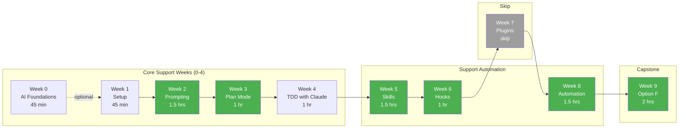

# Quick Start: Support Track

You help customers every day. You want Claude Code to help you respond faster, more accurately, and more consistently. Here's your focused path.

**Estimated Time:** 8-10 hours total

---

## Your Learning Path



**Your Focus Weeks (green):** Weeks 2, 3, 5, 6, 8, and 9 are your power weeks. Week 5 teaches you to create response drafting skills, Week 8 covers context management and workflow design for ticket automation.

### What You'll Cover vs Skip

| Week | Topic | Support Priority | Notes |
| ---- | ----- | ---------------- | ----- |
| 0 | AI Foundations | Recommended | Understand how AI works |
| 1 | Setup & Orientation | Must Do | Get Claude working |
| 2 | Prompting Foundations | Must Do | Draft better responses |
| 3 | Plan Mode | Must Do | Handle complex tickets |
| 4 | TDD with Claude | Must Do | Test-first response writing |
| 5 | Commands & Skills | Must Do | Build `/draft-response` skill |
| 6 | Agents & Hooks | Must Do | Quality checks on responses |
| 7 | Plugins | Skip | Developer-focused |
| 8 | Real-World Workflows | Must Do | Ticket triage automation |
| 9 | Capstone | Must Do | Support-specific option |

---

## Week-by-Week Focus

### Week 0: AI Foundations (45 min) - Recommended

**Goal:** Understand what AI can and can't do for support work.

Key concepts you need:

- **LLM (Large Language Model):** The AI type Claude uses
- **Hallucination:** When AI makes up information (critical for support accuracy!)
- **Context:** How much information AI can "remember" in a conversation
- **Prompt:** How you ask AI to do something

**Why this matters for Support:** You'll understand when AI might give wrong information so you can catch it before sending to customers.

---

### Week 1: Setup & Orientation (45 min)

**Goal:** Get Claude Code working on your machine.

**What to do:**

- [ ] Install Claude Code (follow the guide)
- [ ] Start a conversation with Claude
- [ ] Create a basic CLAUDE.md with support context
- [ ] Ask Claude to help draft a simple response

**Support-Specific Setup:**

Add this to your CLAUDE.md:

```markdown
## My Role
I work in Customer Support at RealManage, helping homeowners with:
- Account questions and payment issues
- Violation notices and appeals
- Community guidelines and CC&Rs
- Board meeting information

## Response Guidelines
- Always be empathetic and professional
- Reference specific policies when applicable
- Provide clear next steps
- Keep responses concise (under 200 words for email)
```

**Checkpoint:** Can you ask Claude to draft a response to a late fee question?

---

### Week 2: Prompting Foundations (1.5 hours) ⭐

**Goal:** Learn to write prompts that generate professional, accurate responses.

**This is your power week.** Good prompts = consistent quality responses.

**The Support Response Formula:**

```text
Draft a response to this customer issue:
[PASTE TICKET/EMAIL]

Context:
- Customer type: [homeowner/board member/vendor]
- Issue type: [billing/violation/maintenance/general]
- Emotional state: [frustrated/confused/neutral]

Requirements:
- Tone: [empathetic/professional/firm but fair]
- Include: [specific policy reference if needed]
- Length: [under X words]
- Next steps: [what customer should do]
```

**Example:**

```text
Draft a response to this customer issue:
"My balance shows $542 but I paid $400 last month. Why is it so high?"

Context:
- Customer type: homeowner
- Issue type: billing
- Emotional state: confused/frustrated

Requirements:
- Tone: empathetic, professional
- Include: breakdown of how fees accumulated
- Length: under 150 words
- Next steps: payment options
```

**Exercise:** Practice with 3 different ticket types and refine your prompts.

---

### Week 3: Plan Mode (1 hour)

**Goal:** Handle complex tickets that need investigation.

**When to use Plan Mode for Support:**

- Tickets with multiple issues
- Escalation decisions
- Research-heavy responses
- Policy interpretation questions

**Example: Multi-Issue Ticket**

```text
I have a ticket with multiple issues that need addressing:
[PASTE TICKET]

Use plan mode to:
1. Identify all distinct issues in this ticket
2. Prioritize which to address first
3. Determine what information I need to gather
4. Outline the response structure
```

**Checkpoint:** Can you use Plan Mode to break down a complex ticket with 3+ issues?

---

### Week 4: TDD with Claude (1 hour)

**Goal:** Define what makes a "good" response before writing it.

**Test-First Response Writing:**

Just like developers write tests before code, define success criteria before drafting:

```text
Before drafting, define success criteria:

Ticket: [PASTE]

This response will be good if it:
- [ ] Acknowledges the customer's specific concern
- [ ] Explains the situation clearly
- [ ] References the correct policy (Section X.X)
- [ ] Provides 2-3 specific next steps
- [ ] Stays under 150 words
- [ ] Uses professional but warm tone

Now draft the response meeting all criteria.
```

**Why This Works:** You catch problems before they happen, not after.

**Checkpoint:** Can you define 5 quality criteria for a late fee response?

---

### Week 5: Commands & Skills (1.5 hours) ⭐

**Goal:** Build your own response drafting skills.

**Create These Support Skills:**

1. `/draft-response` - Generate customer responses
2. `/explain-fee` - Calculate and explain fees
3. `/tone-check` - Review response tone before sending
4. `/escalation-note` - Create escalation documentation

**Example Skill Structure:**

Create `.claude/skills/draft-response/SKILL.md`:

```markdown
---
name: draft-response
description: Draft customer responses based on issue type
argument-hint: <issue-type> "<situation>"
---

# Draft Response Skill

Generate a customer response for the given issue type and situation.

Issue types: late-fee, violation, general, welcome, escalation

## Response Requirements
- Greeting with customer name (if available)
- Acknowledge their concern specifically
- Explain the situation clearly
- Provide concrete next steps
- Professional closing
- Under 200 words

## Context
[Include your standard policies and templates]
```

**Checkpoint:** Can you invoke `/draft-response late-fee "customer confused about $542 balance"` and get a usable draft?

---

### Week 6: Agents & Hooks (1 hour)

**Goal:** Automate quality checks on your responses.

**Quality Hook Concept:**

Before sending any response, automatically check:

1. Is there a greeting?
2. Is there acknowledgment of the concern?
3. Are next steps clear?
4. Is the tone professional?
5. Are there any forbidden phrases?

**What You'll Learn:**

- How hooks can validate response quality
- Setting up pre-send quality gates
- Escalation detection automation

**Note:** This week is more conceptual for Support. Focus on understanding what's possible, not building complex configurations.

---

### Week 7: Skip

Week 7 covers Plugins, which is developer-focused. You can skip this week or skim for general understanding.

---

### Week 8: Real-World Automation (2 hours)

**Goal:** Design workflows for ticket triage and response automation.

Shared session (70 min — all roles attend):

- What automation means for each role
- Context management (`/compact` vs `/clear`)
- Anti-patterns to avoid (retry hammering, verbose prompts, context-nuking)

Support track exercises (45 min):

- Ticket triage automation design
- Response generation workflows with human checkpoints
- Escalation detection patterns

**Checkpoint:** Can you design a triage workflow that handles "WHY IS MY BILL SO HIGH???" appropriately?

---

### Week 9: Capstone (2-3 hours)

**Goal:** Create a complete support toolkit.

**Support Capstone Option: Knowledge Base & Response Templates**

Build:

1. **FAQ Document**
   - Top 20 questions with Claude-assisted answers
   - Policy references for each
   - Escalation criteria

2. **Template Library**
   - 10+ response templates for common issues
   - Variables for personalization
   - Tone guidelines for each

3. **Escalation Decision Tree**
   - When to escalate vs resolve
   - Documentation requirements
   - Manager routing rules

**Deliverables:**

- FAQ document with 20+ entries
- Response template library
- Escalation workflow documentation
- Presentation to team

---

## Support-Specific Prompt Library

### Response Drafting

```text
Draft a response for this support ticket:
[PASTE TICKET]

Requirements:
- Acknowledge their frustration/confusion
- Explain the situation clearly
- Reference policy [X.X] if applicable
- Provide 2-3 specific next steps
- Keep under 150 words
- Professional but warm tone
```

### Fee Explanation

```text
Explain this fee situation:
- Original balance: $[X]
- Current balance: $[Y]
- Months overdue: [N]
- Fee rate: 10% monthly compound

Create a clear breakdown showing how we got from $X to $Y,
with dates and amounts for each fee applied.
```

### Tone Check

```text
Review this draft response for tone:
[PASTE DRAFT]

Check for:
- Empathy (acknowledging their concern)
- Clarity (easy to understand)
- Professionalism (appropriate language)
- Actionability (clear next steps)
- Forbidden phrases (check against our list)

Suggest improvements if needed.
```

### Escalation Documentation

```text
Create an escalation note for ticket #[NUMBER]:
[PASTE TICKET AND CONTEXT]

Include:
- Issue summary (2-3 sentences)
- Customer history (if known)
- Why this needs escalation
- Recommended resolution
- Urgency level
```

### Knowledge Base Entry

```text
Create a FAQ entry for:
[PASTE COMMON QUESTION]

Format:
Q: [Customer-friendly question]
A: [Clear answer under 100 words]
Policy Reference: [Section X.X]
See Also: [Related FAQs]
```

---

## What Support Staff Should Know About AI

### Setting Expectations

| Topic | Reality |
| ----- | ------- |
| Speed | AI drafts responses 3-5x faster |
| Accuracy | ALWAYS verify facts, fees, policies |
| Consistency | AI helps maintain tone standards |
| Personalization | Still needs human touch |
| Complex issues | Human judgment essential |

### AI Strengths for Support

- Drafting initial responses quickly
- Maintaining consistent tone
- Explaining calculations step-by-step
- Generating FAQ content
- Summarizing long ticket threads

### AI Weaknesses to Watch

- May hallucinate policy details - always verify
- Doesn't know account-specific history
- Can't access your ticketing system directly
- May miss emotional nuances
- Doesn't understand context you haven't provided

### Golden Rule

**AI drafts, humans verify and send.** Never send an AI-generated response without reading it first.

---

## Resources

- [Glossary](./glossary.md) - Term definitions
- [Week 0 README](../sessions/week-0/README.md) - AI Foundations
- [Week 2 README](../sessions/week-2/README.md) - Prompting
- [Week 5 Support Track](../sessions/week-5/tracks/support.md) - Skill creation
- [Getting Help](./getting-help.md) - Support channels

---

**Need help?** See [Getting Help](getting-help.md) for support channels.

*Questions? Hit up `#ai-exchange` on Slack. Ask for Support-specific guidance!*
