# Week 4: Test-Driven Development with Claude 🧪

**Duration:** 2 hours
**Format:** Self-paced or instructor-led
**Prerequisites:** Completed Weeks 1-3
**Audience:** RealManage development team

## Learning Tracks

This week has role-specific tracks:

- **Developer Track** - Full TDD content (this README)
- **[QA Track](./tracks/qa.md)** - Writing tests for existing code, coverage gap analysis
- **[PM Track](./tracks/pm.md)** - Writing testable requirements (Given/When/Then)
- **[Support Track](./tracks/support.md)** - Test-first response writing, quality criteria

---

## 🎯 Learning Objectives

By the end of this session, you'll be able to:

- ✅ Implement Red-Green-Refactor cycle with Claude
- ✅ Write tests FIRST, then code (never the reverse!)
- ✅ Achieve RealManage's unit test 80-90% code coverage naturally
- ✅ Use xUnit, FluentAssertions, and Moq effectively
- ✅ Mock external dependencies with confidence
- ✅ Prevent AI hallucinations through test boundaries

## 📋 Pre-Session Checklist

### For Participants

- [ ] Claude Code installed and working
- [ ] .NET 10 SDK installed
- [ ] Completed Weeks 1-3
- [ ] Familiar with basic C# syntax

## 📚 Session Plan

### Part 1: Why TDD Helps Prevent AI Hallucinations (10 min)

#### 1.1 The Problem with AI-Generated Code (5 min)

```markdown
Without tests, AI can:
- Invent methods that don't exist
- Create plausible but wrong logic
- Miss edge cases completely
- Generate untestable code

With TDD, AI must:
- Satisfy concrete test requirements
- Work within defined boundaries
- Handle all specified cases
- Produce verifiable results
```

#### 1.2 Tests as Specifications & The TDD Cycle (5 min)

```csharp
// Bad: Asking Claude without tests
"Create a method to calculate HOA fees"
// Result: Could be anything!

// Good: Define behavior with tests first
[Fact]
public void CalculateMonthlyFee_StandardResident_Returns250()
{
    // Arrange
    var calculator = new FeeCalculator();
    var resident = new Resident { Type = ResidentType.Standard };

    // Act
    var fee = calculator.CalculateMonthlyFee(resident);

    // Assert
    fee.Should().Be(250m);
}
// Now Claude MUST implement exactly this behavior
```



```mermaid
graph LR
    A[🔴 Red<br/>Write Failing Test] --> B[🟢 Green<br/>Make It Pass]
    B --> C[🔄 Refactor<br/>Improve Code]
    C --> A
```

**The Three Laws of TDD:**

1. You may not write production code until you have written a failing test
2. You may not write more of a test than is sufficient to fail
3. You may not write more production code than is sufficient to pass

### Part 2: TDD Fundamentals with Claude (15 min)

#### 2.1 The Workflow (5 min)

**Step 1: Write the test first**

```
> Claude, I need a test for a HomeownerService that validates email format.
> Use xUnit and FluentAssertions. The method should be called IsValidEmail
> and return false for invalid emails.
```

**Step 2: See it fail (Red)**

```bash
dotnet test
# ❌ Test fails - method doesn't exist
```

**Step 3: Implement minimal code (Green)**

```
> Now implement just enough code to make this test pass.
> Don't add any extra functionality.
```

**Step 4: Refactor if needed**

```
> The test still passes. Can you refactor this for better readability?
```

#### 2.2 Key Rules When Using Claude for TDD (5 min)

**The Right Prompts:**

```
✅ "Write a test for X functionality"
✅ "Make this failing test pass with minimal code"
✅ "Refactor while keeping tests green"
✅ "Show me the test output"

❌ "Create a service with tests"
❌ "Add tests to this code"
❌ "Improve test coverage"
```

**Golden Rules:**

- Tests come FIRST, always
- Keep existing tests green
- Minimal code to pass
- Modify tests only when requirements change or tests are wrong

#### 2.3 Coverage Emerges Naturally (5 min)

With proper TDD, you'll hit 80-90% coverage naturally because:

- Every line exists to make a test pass
- No unused code gets written
- Critical business logic is tested first
- Edge cases are handled through tests

> **Why 80-90% and not 100%?** See the [Troubleshooting Guide](../../resources/troubleshooting.md#-test-coverage-target-rationale) for detailed rationale on coverage targets.

*For coverage commands, see [Coverage Guide](./resources/coverage-guide.md)*

### Part 3: Hands-On Exercises (75 min)

> **Note:** Both exercises are configured to build without warnings. If you encounter warnings, ensure you're using .NET 10 and have the latest packages.

#### Exercise 1: Homeowner Setup CLI - Build from Scratch (30 min)

**Your Mission:** Build a complete CLI application using pure TDD

```bash
# Set up your workspace
cd courses/ai-101-claude-code/sessions/week-4
cp -r examples sandbox
cd sandbox/homeowner-setup

# Start Claude
claude
```

**Requirements to implement via TDD:**

1. Add new homeowner with validation
2. Assign property to homeowner
3. Set up payment plans
4. Prevent duplicate registrations
5. Generate welcome packet

**The TDD Dance:**

```
For each requirement:
1. Write test that fails
2. Implement minimal code
3. Refactor when green
4. Check coverage (should be 80-90%)
```

**Sample starting prompt:**

```
I need to build a HomeownerService using TDD. 
First, write a test for adding a new homeowner. The test should:
- Use xUnit and FluentAssertions
- Test that AddHomeowner returns true for valid input
- Test that it throws ArgumentException for missing email
- Follow AAA pattern (Arrange, Act, Assert)
Don't implement the service yet, just the test.
```

#### Exercise 2: Property Manager Enhancement - Extend Existing System (45 min)

**Your Mission:** Add features to an existing property management system

```bash
# If you haven't already created the sandbox:
cd courses/ai-101-claude-code/sessions/week-4
cp -r examples sandbox

# Navigate to this exercise
cd sandbox/property-manager

# Review existing code
claude

> Show me the current test coverage and identify gaps
```

**Starting Point:**

- Working CLI with basic CRUD
- 60% test coverage
- SQLite database with EF Core
- Some services need enhancement

**Features to add via TDD:**

1. Property valuation tracking with history
2. Maintenance request system with priorities
3. Occupancy status management
4. Mock INotificationService for alerts
5. Mock IDocumentStorage for files

**Mocking Example:**

```csharp
[Fact]
public async Task NotifyOwner_SendsEmailAndSms()
{
    // Arrange
    var mockNotifier = new Mock<INotificationService>();
    var service = new PropertyService(mockNotifier.Object);
    
    // Act
    await service.NotifyOwnerOfMaintenance(ownerId, request);
    
    // Assert
    mockNotifier.Verify(x => x.SendEmail(
        It.IsAny<string>(), 
        It.Is<string>(s => s.Contains("Maintenance"))), 
        Times.Once);
    mockNotifier.Verify(x => x.SendSms(
        It.IsAny<string>(), 
        It.IsAny<string>()), 
        Times.Once);
}
```

**Key Focus Areas:**

- Dependency injection patterns
- In-memory database for testing
- Mocking external services
- Bringing coverage from 60% → 80-90%

### Part 4: Best Practices & Patterns (15 min)

#### 4.1 Test Organization (5 min)

```csharp
public class HomeownerServiceTests
{
    // Group by method being tested
    public class AddHomeownerMethod
    {
        [Fact]
        public void ValidInput_ReturnsTrue() { }
        
        [Fact]
        public void NullEmail_ThrowsArgumentException() { }
        
        [Fact]
        public void DuplicateEmail_ReturnsFalse() { }
    }
    
    public class GetHomeownerMethod
    {
        [Fact]
        public void ExistingId_ReturnsHomeowner() { }
        
        [Fact]
        public void NonExistentId_ReturnsNull() { }
    }
}
```

#### 4.2 FluentAssertions Power (5 min)

```csharp
// Instead of basic assertions
Assert.Equal(250m, fee);
Assert.True(result);
Assert.Throws<ArgumentException>(() => service.Add(null));

// Use FluentAssertions for readability
fee.Should().Be(250m);
result.Should().BeTrue();
service.Invoking(s => s.Add(null))
    .Should().Throw<ArgumentException>()
    .WithMessage("Email cannot be null");

// Complex assertions
homeowner.Should().BeEquivalentTo(expected, options => 
    options.Excluding(h => h.Id)
           .Excluding(h => h.CreatedDate));
```

#### 4.3 Mocking Best Practices (5 min)

```csharp
// Setup reusable mocks
public class PropertyServiceTests
{
    private readonly Mock<INotificationService> _notifierMock;
    private readonly Mock<IDocumentStorage> _storageMock;
    private readonly PropertyService _service;
    
    public PropertyServiceTests()
    {
        _notifierMock = new Mock<INotificationService>();
        _storageMock = new Mock<IDocumentStorage>();
        _service = new PropertyService(
            _notifierMock.Object, 
            _storageMock.Object);
    }
    
    [Fact]
    public async Task SaveDocument_CallsStorageOnce()
    {
        // Arrange
        _storageMock.Setup(x => x.SaveAsync(It.IsAny<byte[]>()))
                    .ReturnsAsync("doc-123");
        
        // Act
        var result = await _service.SavePropertyPhoto(photo);
        
        // Assert
        result.Should().Be("doc-123");
        _storageMock.Verify(x => x.SaveAsync(
            It.IsAny<byte[]>()), Times.Once);
    }
}
```

### Part 5: Reflection & Wrap-Up (5 min)

Discuss what worked, what was challenging, and how TDD changes your development approach.

## 🎯 Key Takeaways

### The TDD Promises

1. **No untested code** - If it's not tested, it doesn't exist
2. **Living documentation** - Tests show how code works
3. **Confident refactoring** - Tests catch breaking changes
4. **AI hallucination prevention** - Tests are guardrails
5. **Natural high coverage** - 80-90% without forcing it

### Quick Reference

See [TDD Cheat Sheet](./resources/tdd-cheatsheet.md) and [Coverage Guide](./resources/coverage-guide.md) for commands and patterns.

## 📝 Homework (Before Week 5)

### Required Tasks

1. ✅ Complete both exercises if not finished
2. ✅ Add one more feature using TDD to either project
3. ✅ Achieve 80-90% coverage on your additions
4. ✅ Share your test-first approach in `#ai-exchange`
5. ✅ Try TDD on a real work task

### Stretch Goals

1. 🎯 Reach 90%+ coverage on Exercise 1
2. 🎯 Create property tax calculation with complex rules via TDD
3. 🎯 Build a test helper library for common HOA scenarios

### Skill Check

Write tests FIRST for:

```csharp
// A service that:
// - Calculates HOA reserve funds needed
// - Based on property age and type
// - Includes emergency fund buffer
// - Returns monthly contribution per unit
```

## 🔗 Resources

### Official Documentation

- [xUnit Documentation](https://xunit.net/docs/getting-started/netcore/cmdline)
- [FluentAssertions Guide](https://fluentassertions.com/introduction)
- [Moq Quickstart](https://github.com/moq/moq4/wiki/Quickstart)
- [Coverlet Documentation](https://github.com/coverlet-coverage/coverlet)

### RealManage Resources

- [TDD Cheat Sheet](./resources/tdd-cheatsheet.md)
- [Coverage Guide](./resources/coverage-guide.md)
- [Week 4 Examples](./examples/) - Both exercise projects
- Slack: `#ai-exchange` for TDD help

### Additional Reading

- [Test Driven Development: By Example](https://www.amazon.com/Test-Driven-Development-Kent-Beck/dp/0321146530) - Kent Beck
- [Growing Object-Oriented Software, Guided by Tests](https://www.amazon.com/Growing-Object-Oriented-Software-Guided-Tests/dp/0321503627)
- [The Three Laws of TDD](https://www.youtube.com/watch?v=AoIfc5NwRks) - Uncle Bob

## 📊 Success Metrics

### You're ready for Week 5 when you can

- [ ] Write tests before any production code
- [ ] Follow Red-Green-Refactor without shortcuts
- [ ] Achieve 80-90% coverage naturally
- [ ] Mock external dependencies effectively
- [ ] Use FluentAssertions fluently

### Red Flags (seek help if)

- [ ] Writing code before tests
- [ ] Tests failing after refactoring
- [ ] Coverage below 80%
- [ ] Mocking feels confusing
- [ ] Tests are testing implementation, not behavior

## Advanced Techniques: From Learning to Production 🚀

### Two Approaches to TDD with Claude Code

#### 1. Granular Approach (Learning Mode) 📚

Perfect for beginners and when learning TDD discipline:

```markdown
> Write a test for email validation
[Claude writes one test]
> Make it pass
[Claude writes minimal code]
> Write a test for phone validation
[Claude writes one test]
> Make it pass
[Claude writes minimal code]
```

**Benefits:**

- Forces Red-Green-Refactor discipline
- Prevents over-engineering
- Builds muscle memory
- Clear learning progression

#### 2. Batched Approach (Production Mode) 💯

For experienced developers who've internalized TDD:

```markdown
## Prime Directives in CLAUDE.md

1. **Red/Green/Refactor TDD** - No production code without failing test
2. **80-90% coverage target** - Test critical paths
3. **Idiomatic C#** - Modern patterns only
4. **End with reminder** - "Follow TDD and C# best practices"

> Implement a complete HomeownerService with email/phone validation
[Claude writes full test suite THEN implementation]
```

**Benefits:**

- 3-5x faster development
- Natural design emergence
- Better flow state
- Real-world practical

### Creating Your Own Prime Directives

Instead of micromanaging each test, codify your TDD rules:

```markdown
## 🚨 Prime Directives for HOA Development

1. **ALWAYS Red/Green/Refactor** - Write failing test, make it pass, refactor
2. **Test business logic only** - Not framework behavior  
3. **Mock all external deps** - Email, SMS, payment gateways
4. **80-90% coverage target** - Focus on critical paths
5. **Idiomatic C# always** - Records, nullable refs, modern patterns
6. **Domain-first design** - Model HOA concepts accurately
7. **Ship daily** - Working code > perfect code
8. **End every response with**: "Following TDD and C# best practices"
```

This becomes your configuration-as-code for AI behavior!

### When to Use Each Approach

| Situation | Approach | Why |
| --------- | -------- | --- |
| Learning TDD | Granular | Builds discipline |
| Teaching others | Granular | Shows process clearly |
| New to domain | Granular | Explores carefully |
| Production work | Batched | Maximum efficiency |
| Side projects | Batched | Faster iteration |
| Complex features | Batched | Holistic design |

### Production Tips 🎯

> **Evolution Path**: Start granular → Build confidence → Create Prime Directives → Work batched

1. **Start with granular** for first few sessions
2. **Identify your patterns** - What rules do you always follow?
3. **Codify in CLAUDE.md** - Turn patterns into Prime Directives
4. **Trust but verify** - Review test suites before implementation
5. **Iterate your rules** - Refine based on what works

### Example Session Evolution

**Week 1 (Granular):**

```
> Write test for X
> Implement X
> Write test for Y
> Implement Y
```

**Week 4 (Hybrid):**

```
> Write all validation tests
> Implement validation module
```

**Week 8 (Batched with Prime Directives):**

```
> Build complete payment processing with TDD
[Claude follows CLAUDE.md rules automatically]
```

### The Key Insight 💡

The granular approach teaches you to think in tests. The batched approach with Prime Directives lets you work at the speed of thought while maintaining discipline. Your CLAUDE.md becomes your automated TDD coach!

---

## 🚀 Next Week Preview

**Week 5: Commands & Basic Skills**

- Custom slash commands
- Building reusable skills
- Supporting files and templates
- Command vs skill decision making

**Pre-work:** Think about repetitive tasks that could benefit from custom commands  

---

---

*End of Week 4 Session Plan*
*Next Session: Week 5 - Commands & Basic Skills*
