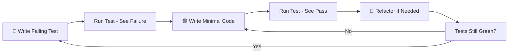

# Homeowner Setup - TDD Exercise

## 🚨 CRITICAL TDD RULES
1. **NEVER** write production code without a failing test
2. **NEVER** modify a passing test  
3. Write **MINIMAL** code to make tests pass
4. Refactor **ONLY** when tests are green
5. Target **80-90% coverage minimum**

## TDD Workflow - Red → Green → Refactor



## Project Structure

```
/homeowner-setup
├── Program.cs                   # Empty - Build via TDD
├── Models/                      # Empty - Create via TDD
├── Services/                    # Empty - Create via TDD  
├── Tests/
│   └── HomeownerServiceTests.cs # Starting point with TODOs
└── RealManage.HomeownerSetup.csproj
```

## C# Testing Best Practices

### Test Naming Convention
```csharp
[Fact]
public void MethodName_StateUnderTest_ExpectedBehavior()
{
    // Arrange - Setup
    // Act - Execute
    // Assert - Verify
}
```

### FluentAssertions Patterns
```csharp
// Preferred style
result.Should().NotBeNull();
result.Should().Be(expected);
action.Should().Throw<ArgumentException>()
    .WithMessage("Invalid email");

// Collections
list.Should().HaveCount(3);
list.Should().Contain(x => x.Name == "John");
```

### Moq Usage
```csharp
// Setup mock
var mock = new Mock<IEmailService>();
mock.Setup(x => x.SendEmail(It.IsAny<string>()))
    .ReturnsAsync(true);

// Verify calls
mock.Verify(x => x.SendEmail("test@example.com"), Times.Once);
```

### In-Memory Database Pattern
```csharp
// For data access tests
var options = new DbContextOptionsBuilder<AppContext>()
    .UseInMemoryDatabase(databaseName: Guid.NewGuid().ToString())
    .Options;

using var context = new AppContext(options);
```

## Business Context

You're building a homeowner management system for HOA administration. Consider:

- **Data integrity**: What validations are critical?
- **Business rules**: What constraints must be enforced?
- **User operations**: What actions do users need?
- **External integrations**: What services might connect?

## Getting Started

1. Open `Tests/HomeownerServiceTests.cs`
2. Look for TODO comments
3. Write your **first failing test**
4. See it fail (compilation or assertion)
5. Write **minimal** code to pass
6. See it go green
7. Refactor if needed
8. Repeat

## Common TDD Mistakes to Avoid

❌ Writing multiple tests before implementing  
❌ Adding functionality not required by tests  
❌ Modifying tests to match implementation  
❌ Writing tests after the code  
❌ Testing implementation details instead of behavior  

## Success Metrics

✅ All tests written first  
✅ Each test fails before passing  
✅ Minimal code to pass each test  
✅ 80-90% coverage achieved naturally  
✅ Clean, refactored code with green tests  

## Sample Test Progression

1. Start with the simplest validation
2. Add happy path scenarios
3. Include error cases
4. Test edge conditions
5. Add integration tests with mocks

## Remember

- Let tests **drive** the design
- Start simple, add complexity incrementally
- Mock external dependencies
- Each test should test **one thing**
- Coverage emerges naturally from proper TDD
- You control the tests, not the AI!