# TDD Cheat Sheet 🧪

## The Sacred Cycle: Red → Green → Refactor

```mermaid
graph LR
    A[🔴 Red<br/>Write Failing Test] --> B[🟢 Green<br/>Make It Pass]
    B --> C[🔄 Refactor<br/>Improve Code]
    C --> A
```



## The Three Laws of TDD

1. **You may not write production code** until you have written a failing test
2. **You may not write more of a test** than is sufficient to fail
3. **You may not write more production code** than is sufficient to pass

## Working with Claude Code

### ✅ DO Say This

```text
"Write a test for [specific functionality]"
"Make this failing test pass with minimal code"
"Refactor while keeping tests green"
"Show me the test failure first"
```

### ❌ DON'T Say This

```text
"Create a service with tests"
"Add tests to this code"
"Improve test coverage"
"Write the implementation"
```

## xUnit Test Structure

```csharp
[Fact]
public void MethodName_Scenario_ExpectedResult()
{
    // Arrange - Set up test data
    var service = new ServiceUnderTest();
    var input = new TestData();
    
    // Act - Call the method
    var result = service.Method(input);
    
    // Assert - Verify the result
    result.Should().Be(expectedValue);
}
```

## FluentAssertions Quick Reference

```csharp
// Basic assertions
result.Should().BeTrue();
result.Should().BeFalse();
result.Should().Be(expected);
result.Should().BeNull();
result.Should().NotBeNull();

// Numeric assertions
number.Should().BeGreaterThan(5);
number.Should().BeLessThanOrEqualTo(10);
number.Should().BeInRange(1, 100);

// String assertions
text.Should().Contain("substring");
text.Should().StartWith("prefix");
text.Should().BeNullOrWhiteSpace();

// Collection assertions
list.Should().HaveCount(3);
list.Should().Contain(item);
list.Should().BeEmpty();
list.Should().ContainSingle(x => x.Id == 1);

// Exception assertions
action.Should().Throw<ArgumentException>();
action.Should().Throw<Exception>()
    .WithMessage("Expected message");

// Object comparison
actual.Should().BeEquivalentTo(expected);
actual.Should().BeEquivalentTo(expected, options =>
    options.Excluding(x => x.Id));
```

## Moq Quick Reference

```csharp
// Create mock
var mock = new Mock<IService>();

// Setup method return
mock.Setup(x => x.Method(It.IsAny<string>()))
    .Returns("result");

// Setup async method
mock.Setup(x => x.MethodAsync(It.IsAny<int>()))
    .ReturnsAsync(true);

// Setup with specific argument
mock.Setup(x => x.Method("specific"))
    .Returns("special");

// Setup to throw exception
mock.Setup(x => x.Method(It.IsAny<string>()))
    .Throws<InvalidOperationException>();

// Verify method was called
mock.Verify(x => x.Method(It.IsAny<string>()), Times.Once);
mock.Verify(x => x.Method("specific"), Times.Exactly(2));
mock.Verify(x => x.Method(It.Is<string>(s => s.Length > 5)), Times.Never);

// Use mock in test
var service = new ServiceUnderTest(mock.Object);
```

## In-Memory Database Testing

```csharp
public class ServiceTests : IDisposable
{
    private readonly DbContext _context;
    private readonly ServiceUnderTest _service;
    
    public ServiceTests()
    {
        var options = new DbContextOptionsBuilder<AppContext>()
            .UseInMemoryDatabase(databaseName: Guid.NewGuid().ToString())
            .Options;
        
        _context = new AppContext(options);
        _context.Database.EnsureCreated();
        _service = new ServiceUnderTest(_context);
    }
    
    public void Dispose()
    {
        _context.Dispose();
    }
}
```

## Coverage Commands

```bash
# Run tests with coverage
dotnet test /p:CollectCoverage=true /p:CoverletOutputFormat=opencover

# Alternative coverage collection
dotnet test --collect:"XPlat Code Coverage"

# With specific metrics
dotnet test /p:CollectCoverage=true \
            /p:CoverletOutputFormat=opencover \
            /p:Threshold=80 \
            /p:ThresholdType=line

# Generate HTML report (requires reportgenerator)
dotnet tool install -g dotnet-reportgenerator-globaltool
reportgenerator -reports:coverage.opencover.xml -targetdir:coveragereport
```

## TDD Workflow

```text
1. 🤔 Think about what you want to implement
2. 📝 Write a test that describes the behavior
3. 🔴 Run test - see it fail (compilation or assertion)
4. ✍️ Write minimal code to make test pass
5. 🟢 Run test - see it pass
6. 🔄 Refactor if needed (tests stay green)
7. ✅ Commit your changes
8. 🔁 Repeat for next behavior
```

## Common Patterns

### Testing Async Methods

```csharp
[Fact]
public async Task MethodAsync_Condition_Result()
{
    // Arrange
    var service = new ServiceUnderTest();
    
    // Act
    var result = await service.MethodAsync();
    
    // Assert
    result.Should().NotBeNull();
}
```

### Testing Collections

```csharp
[Theory]
[InlineData("input1", "expected1")]
[InlineData("input2", "expected2")]
[InlineData("input3", "expected3")]
public void Method_MultipleInputs_CorrectResults(string input, string expected)
{
    // Arrange
    var service = new ServiceUnderTest();
    
    // Act
    var result = service.Method(input);
    
    // Assert
    result.Should().Be(expected);
}
```

### Testing with Dependency Injection

```csharp
public class ServiceTests
{
    private readonly Mock<IDependency> _mockDep;
    private readonly ServiceUnderTest _service;
    
    public ServiceTests()
    {
        _mockDep = new Mock<IDependency>();
        _service = new ServiceUnderTest(_mockDep.Object);
    }
    
    [Fact]
    public void Method_CallsDependency()
    {
        // Arrange
        _mockDep.Setup(x => x.GetData()).Returns("test");
        
        // Act
        var result = _service.Method();
        
        // Assert
        _mockDep.Verify(x => x.GetData(), Times.Once);
        result.Should().Be("test");
    }
}
```

## Remember

- **Tests are specifications** - They define behavior
- **Red-Green-Refactor** - Never skip steps
- **One assertion per test** - Clear failures
- **Test behavior, not implementation** - What, not how
- **Coverage emerges naturally** - Don't chase numbers
- **Tests are immutable** - Once green, don't change
- **Mock external dependencies** - Test in isolation
- **Use descriptive names** - Tests are documentation

---

*"The best tests are the ones you write before the code exists."* 🚀
