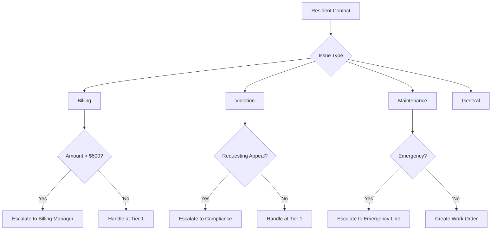

# Option F: Knowledge Base & Response Templates

**Track:** Support Team
**Focus:** FAQs, response templates, customer communication tools
**NOTE:** This is primarily a documentation-focused capstone

## Overview

Build a comprehensive support toolkit using Claude Code:

- FAQ generation from existing documentation
- Response template library for common issues
- Customer communication tools and scripts
- Escalation decision tree

## Getting Started

```bash
# Copy this template to your sandbox
cd courses/ai-101-claude-code/sessions/week-9
cp -r examples/capstone-templates/option-f-support-knowledge-base sandbox/
cd sandbox/option-f-support-knowledge-base

# Start Claude Code
claude
```

## Project Structure

```
option-f-support-knowledge-base/
├── README.md
├── CLAUDE.md                    # Your project context
├── content/
│   ├── faq.md                   # Generated FAQs
│   ├── escalation-tree.md       # Escalation decision tree
│   └── quality-checklist.md     # Response quality guidelines
├── templates/
│   ├── billing-templates.md
│   ├── violation-templates.md
│   ├── maintenance-templates.md
│   └── general-templates.md
├── tools/
│   ├── email-templates.md
│   ├── phone-scripts.md
│   ├── chat-responses.md
│   └── difficult-conversations.md
└── .claude/
    └── skills/
        └── draft-response/
            └── SKILL.md
```

## Key Deliverables

### 1. FAQ Document (`content/faq.md`)

Cover these categories with 5+ questions each:

**Account & Billing:**
- How do I view my account balance?
- When are dues payments due?
- What happens if I pay late?
- Can I set up automatic payments?
- How do I request a payment plan?

**Violations:**
- What is a violation notice?
- How do I respond to a violation?
- What are the fine amounts?
- How do I appeal a violation?
- What is the cure period?

**Maintenance & Amenities:**
- How do I submit a maintenance request?
- What are the pool hours?
- How do I reserve the clubhouse?
- Who do I contact for emergencies?
- What maintenance is my responsibility?

**General:**
- When are board meetings?
- How do I access HOA documents?
- How do I update my contact information?
- What are the architectural review rules?
- How do I contact the management company?

### 2. Response Template Library (`templates/`)

Create templates for each category. Example format:

```markdown
## Template: Late Fee Explanation

**Use When:** Resident asks why they have late fees

**Subject Line:** Re: Late Fee Inquiry - Account [ACCOUNT_NUMBER]

**Body:**

Dear [RESIDENT_NAME],

Thank you for reaching out regarding the late fee on your account.

I understand that unexpected charges can be frustrating, and I'm happy
to explain how this fee was applied.

According to our HOA policies, monthly assessments are due on the 1st
of each month, with a 30-day grace period. After this grace period,
a late fee of 10% is applied to any unpaid balance, compounding monthly.

Your account shows:
- Original assessment: [AMOUNT]
- Due date: [DATE]
- Payment received: [DATE] (or "Payment not yet received")
- Late fee applied: [AMOUNT]

**Options available to you:**
1. Pay the current balance to stop additional late fees
2. Request a payment plan if you're experiencing financial hardship
3. Contact us if you believe this charge was applied in error

Please let me know how you'd like to proceed, or if you have any
questions about this explanation.

Best regards,
[YOUR_NAME]
RealManage Support Team
[PHONE_NUMBER] | [EMAIL]

---

**Personalization Points:**
- [RESIDENT_NAME] - First and last name
- [ACCOUNT_NUMBER] - Their account ID
- [AMOUNT] - Specific dollar amounts
- [DATE] - Relevant dates
- [YOUR_NAME] - Support rep name

**Follow-up Actions:**
- If payment plan requested: Escalate to billing
- If disputing charge: Document and escalate to manager
- If paid: Confirm receipt within 24 hours
```

### 3. Communication Tools (`tools/`)

**Email Templates** - Written correspondence for various scenarios

**Phone Scripts** - Structured guides for calls:
```markdown
## Phone Script: Violation Notice Call

**Opening:**
"Hello, this is [NAME] from RealManage calling for [RESIDENT].
May I speak with them please?"

**Purpose Statement:**
"I'm calling regarding a recent notice that was sent to your
property. Do you have a moment to discuss it?"

**Key Points to Cover:**
1. Explain what was observed
2. Reference the specific CCR section
3. Explain the cure period (30 days)
4. Answer questions
5. Confirm next steps

**Closing:**
"Is there anything else I can help you with today?"
```

**Chat Responses** - Quick responses for live chat

**Difficult Conversations** - De-escalation guides

### 4. Escalation Decision Tree (`content/escalation-tree.md`)

Create a visual decision tree using Mermaid:

```markdown
## Escalation Decision Tree



## Escalation Contacts

| Issue Type | Escalation Contact | Response Time |
|------------|-------------------|---------------|
| Billing > $500 | billing-manager@realmanage.com | 4 hours |
| Violation Appeal | compliance@realmanage.com | 24 hours |
| Emergency Maintenance | (555) 123-4567 | Immediate |
| Legal Threat | legal@realmanage.com | 2 hours |
```

## Custom Skill: `/draft-response`

Create `.claude/skills/draft-response/SKILL.md`:

```markdown
---
name: draft-response
description: Draft a response for a resident inquiry
argument-hint: [issue_type] [brief_description]
---

Draft a professional response for: $1 - $2

## Response Guidelines
1. Start with empathy/acknowledgment
2. Provide clear, accurate information
3. Offer next steps or options
4. Close professionally with contact info

## Tone
- Professional but friendly
- Empathetic but firm on policies
- Clear, no jargon
- Action-oriented

## Include
- Relevant policy reference (if applicable)
- Timeline expectations
- Contact information for follow-up
```

## Success Criteria

```
[ ] FAQ covers top 20 resident questions
[ ] Response templates are professional and accurate
[ ] Templates include personalization placeholders
[ ] Escalation paths are clearly documented
[ ] All content generated with Claude assistance
[ ] Templates reviewed for tone and accuracy
```

## Example Prompts

```
# FAQ Generation
"Generate a FAQ section for HOA billing questions. Include
at least 5 questions with detailed, resident-friendly answers.
Cover dues, late fees, payment methods, and payment plans."

# Template Creation
"Create an email template for responding to a resident who
received a violation notice for lawn maintenance. The template
should be empathetic but clear about the requirements and
timeline for correction."

# Escalation Criteria
"Define the escalation criteria for billing disputes. When
should a Tier 1 support agent escalate to a billing manager
versus handling it themselves?"

# Difficult Conversation
"Write a phone script for handling a resident who is very
upset about a fine they received. Include de-escalation
techniques and key phrases to use."
```

## Tips for Success

- **Use real scenarios**: Base templates on actual support tickets
- **Get the tone right**: Professional but human
- **Include policy references**: Support answers with sources
- **Test with colleagues**: Have others review for clarity
- **Cover edge cases**: What if the standard answer doesn't fit?

## Resources

- [Customer Service Best Practices](https://www.helpscout.com/blog/)
- [De-escalation Techniques](https://www.mindtools.com/pages/article/dealing-with-angry-customers.htm)
- [Writing Clear Instructions](https://www.plainlanguage.gov/)
