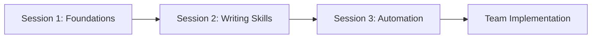

# BDD 101: Behavior-Driven Development Foundations 🎯

**Duration:** 3 sessions (2 hours each)  
**Level:** Beginner  
**Format:** Interactive workshops with hands-on exercises  
**Goal:** Enable a small development team to define work in BDD form and start their test automation journey

## 📚 Course Overview

This practical course introduces Behavior-Driven Development (BDD) to development teams with little to no experience in defining requirements using BDD practices or test automation. You'll learn to bridge the gap between business requirements and technical implementation through clear, collaborative specifications.

## 🎯 What You'll Learn

By completing this course, you'll be able to:

- ✅ Write clear, business-readable scenarios using Gherkin syntax
- ✅ Facilitate effective Three Amigos conversations
- ✅ Transform user stories into testable scenarios
- ✅ Avoid common BDD anti-patterns and pitfalls
- ✅ Create living documentation that stays valuable over time
- ✅ Set up basic test automation with step definitions
- ✅ Integrate BDD scenarios into your development workflow

## 🎭 Target Audience

This course is designed for:

- **Software Engineers** new to BDD and test automation
- **Product Managers** who want better requirement specifications
- **Quality-minded Engineers** looking to improve test design
- **Teams** seeking better collaboration between business and technical stakeholders

## 🗺️ Learning Path



## 📁 Course Structure

```text

bdd-101/
├── resources/                     # Reference materials
│   ├── gherkin-reference.md      # Syntax guide and examples
│   ├── bdd-patterns.md           # Common patterns and practices
│   └── troubleshooting.md        # Solutions to common issues
├── exercises/                     # Practice materials
│   ├── user-story-templates.md   # Templates for practice
│   └── scenario-practice/        # Workshop exercises
├── sessions/                      # Session-by-session content
│   ├── session-1/                # BDD Foundations & Gherkin
│   ├── session-2/                # Writing Effective Scenarios
│   └── session-3/                # From Scenarios to Automation
├── CLAUDE.md                      # Course context for AI assistance
└── README.md                      # You are here
```

## 🚀 Quick Start

### Prerequisites

Before starting, ensure your team has:

- [ ] Basic understanding of user stories
- [ ] Familiarity with software testing concepts
- [ ] Access to a text editor or IDE
- [ ] (Optional) .NET development environment for automation examples

### Getting Started

1. **Review Course Materials** → Start with [Session 1](./sessions/session-1/README.md)

2. **Practice in Groups** → Form Three Amigos teams (Business, Dev, QA)

3. **Work Through Exercises** → Use real examples from your project

4. **Implement Gradually** → Start with one feature area

---

## 📖 Three-Session Curriculum

## Session 1: BDD Foundations & Gherkin Syntax

**Duration:** 2 hours  
**Focus:** Understanding BDD principles and learning Gherkin

### Learning Objectives

- Understand what BDD is and why it matters
- Learn the Three Amigos collaboration model
- Master Gherkin syntax (Given-When-Then)
- Practice converting user stories to scenarios

### Session Outline

1. **BDD Introduction** (30 min)
   - What is BDD and how it differs from TDD
   - The collaboration triangle: Business, Development, Testing
   - Living documentation concept
2. **Gherkin Fundamentals** (45 min)
   - Given-When-Then structure
   - Keywords: Feature, Scenario, Background
   - Writing clear, business-readable scenarios
3. **Hands-on Workshop** (35 min)
   - Convert provided user stories to Gherkin scenarios
   - Practice with real team examples
   - Peer review and feedback
4. **Wrap-up & Next Steps** (10 min)

### [→ Full Session 1 Content](./sessions/session-1/README.md)

---

## Session 2: Writing Effective Scenarios

**Duration:** 2 hours  
**Focus:** Scenario quality, maintainability, and advanced Gherkin

### Learning Objectives

- Identify and avoid common BDD anti-patterns
- Write maintainable, focused scenarios
- Use advanced Gherkin features effectively
- Create scenarios that serve as living documentation

### Session Outline

1. **Scenario Quality Principles** (30 min)
   - Good vs. bad scenarios analysis
   - Common anti-patterns and how to avoid them
   - The single responsibility principle for scenarios
2. **Advanced Gherkin Features** (45 min)
   - Scenario Outlines and Examples tables
   - Background sections for setup
   - Data Tables for complex inputs
   - Tags for organization
3. **Refactoring Workshop** (35 min)
   - Improve poorly written scenarios
   - Practice with team's existing requirements
   - Group exercise: scenario review
4. **Documentation Strategy** (10 min)
   - Organizing scenarios as living documentation

### [→ Full Session 2 Content](./sessions/session-2/README.md)

---

## Session 3: From Scenarios to Automation

**Duration:** 2 hours  
**Focus:** Test automation setup and implementation

### Learning Objectives

- Understand how BDD scenarios become automated tests
- Write basic step definitions
- Set up a simple BDD automation framework
- Plan automation strategy for the team

### Session Outline

1. **BDD Automation Overview** (30 min)
   - How scenarios become executable tests
   - Tools landscape (Reqnroll, Cucumber, etc.)
   - The test pyramid and BDD's place
2. **Step Definitions** (45 min)
   - Writing step definitions in C#
   - Parameter binding and data transformation
   - Sharing state between steps
3. **Hands-on Automation** (35 min)
   - Set up a simple Reqnroll project
   - Implement step definitions for workshop scenarios
   - Run automated tests
4. **Team Implementation Planning** (10 min)
   - Discuss integration with existing workflow
   - Plan next steps for the team

### [→ Full Session 3 Content](./sessions/session-3/README.md)

---

## 🎓 Success Metrics

You're ready to implement BDD when you can:

- Write a clear scenario for a new feature requirement
- Identify when a scenario violates BDD principles
- Facilitate a Three Amigos conversation
- Set up basic test automation for a scenario
- Explain BDD benefits to stakeholders

## 🚩 Warning Signs

Seek additional help if:

- Scenarios read like technical test scripts
- Business stakeholders can't understand scenarios
- Scenarios are too detailed or too vague
- Test automation becomes overly complex
- BDD is being forced into every testing situation

## 🤝 Getting Help

### During the Course

- **Questions**: Ask during sessions or via team chat
- **Practice**: Use provided exercises and examples
- **Review**: Peer review scenario writing

### After the Course

- **Community**: Join BDD communities and forums
- **Books**: "Specification by Example" by Gojko Adzic
- **Tools**: Explore SpecFlow, Cucumber documentation
- **Practice**: Start small with one feature area

## 📚 Additional Resources

### Essential Reading

- [Specification by Example](https://www.manning.com/books/specification-by-example) - Gojko Adzic
- [The Cucumber Book](https://pragprog.com/titles/hwcuc2/the-cucumber-book-second-edition/) - Matt Wynne & Aslak Hellesøy
- [BDD in Action](https://www.manning.com/books/bdd-in-action) - John Ferguson Smart

### Tools & Frameworks

- **Reqnroll** (.NET) - <https://docs.reqnroll.net/latest/index.html>
- **Cucumber** (Multiple languages) - <https://cucumber.io/>
- **Gherkin Reference** - <https://cucumber.io/docs/gherkin/>

### Community Resources

- **BDD Community** - <https://cucumber.io/community/>
- **Reqnroll Documentation** - <https://docs.reqnroll.net/latest/index.html>

## 💡 Pro Tips

1. **Start Small**: Begin with one feature or user story
1. **Involve Everyone**: Make sure business stakeholders actively participate
1. **Keep It Simple**: Avoid over-engineering scenarios
1. **Regular Reviews**: Schedule periodic scenario review sessions
1. **Living Documentation**: Keep scenarios up-to-date with code changes

---

## Course Progress Tracker

Track your team's progress through the course:

### Session Completion

- [ ] Session 1: BDD Foundations & Gherkin completed
- [ ] Session 2: Writing Effective Scenarios completed  
- [ ] Session 3: From Scenarios to Automation completed

### Practical Application

- [ ] Converted first user story to Gherkin scenarios
- [ ] Facilitated first Three Amigos session
- [ ] Set up basic BDD automation framework
- [ ] Integrated BDD scenarios into development workflow

### Team Adoption

- [ ] All team members can write basic scenarios
- [ ] Business stakeholders actively participate in scenario writing
- [ ] Scenarios are maintained as living documentation
- [ ] BDD process is integrated into definition of done

---

**Questions?** Review the [troubleshooting guide](./resources/troubleshooting.md) or reach out to your instructor.
