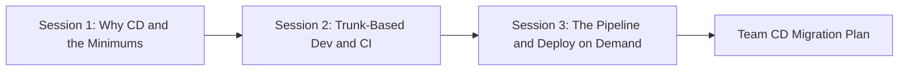

# Continuous Delivery 101: Ship Small, Safe, and Often 🚀

**Duration:** 3 sessions (2 hours each)
**Level:** Intermediate
**Format:** Interactive workshops with hands-on exercises
**Goal:** Move a development team from weekly deployments with long-lived branches to true Continuous Delivery on AWS cloud-native services

## 📚 Course Overview

This course teaches the engineering discipline of **Continuous Delivery (CD)**: keeping software in an always-deployable state so that any change can reach production safely, on demand. It is built directly on the practices catalogued at [minimumcd.org](https://minimumcd.org) — the industry's minimum bar for what CD actually requires. It grounds every practice in how RealManage builds today: our established .NET Framework APIs on Azure VMs will be with us for a long time, but new work is increasingly **small and cloud-native on AWS** (Lambda, ECS, DynamoDB, SNS, SQS), and we're applying the **strangler fig pattern** to gradually carve functionality out of the monoliths — a migration we work end to end in [Strangler Fig in Practice](./sessions/session-3/examples/strangler-fig-violations.md). CD is the discipline that keeps that growing fleet of small services deliverable.

If your team deploys weekly, keeps feature branches alive for days or weeks, and treats release day as an event to brace for, this course is for you. CD is not a tool you install — it is a set of working agreements and engineering practices that make small, frequent, low-drama releases the normal way you work.

## 🎯 What You'll Learn

By completing this course, you'll be able to:

- ✅ Explain what Continuous Delivery is, what it is *not*, and why small batches beat big ones
- ✅ Recite and apply the **MinimumCD** practices for CI and CD
- ✅ Practice trunk-based development with short-lived branches instead of long-lived ones
- ✅ Decouple *deploy* from *release* using feature flags
- ✅ Read and reason about a pipeline as the single, definitive path to production
- ✅ Build immutable artifacts and promote the *same* artifact across dev → qa → prod
- ✅ Recover from a bad deploy — fail forward by default, roll back when it's costly and time-sensitive
- ✅ Assess your team's current state and write a concrete CD migration plan

> **New to any of these terms?** Each is defined in plain language in the [Glossary](./resources/glossary.md) and introduced in the session that uses it — you don't need to know them going in.

## 🎭 Target Audience

This course is designed for:

- **Software Engineers** building the new cloud-native AWS services
- **Tech Leads** responsible for a team's branching and release workflow
- **Engineering Leaders** who must approve the change windows and process shifts CD requires
- **Teams** currently on weekly releases and long-lived branches who want to deliver continuously

It assumes working knowledge of Git, basic AWS familiarity (Lambda, CloudFormation/SAM), and GitLab CI/CD. Deep AWS expertise is **not** required — examples are explained.

## 🗺️ Learning Path



## 📁 Course Structure

```text
continuous-delivery-101/
├── resources/                          # Reference materials
│   ├── minimums-reference.md          # The MinimumCD CI + CD practices, cited
│   ├── glossary.md                    # CD vocabulary
│   ├── migration-checklist.md         # The 5-phase migration path as a checklist
│   ├── communicating-releases.md      # Release notes & client comms once deploy ≠ release
│   ├── governance-and-compliance.md   # Control, audit, segregation of duties, break-glass
│   ├── what-cd-costs.md               # The honest costs of CD + a flag-debt mechanism
│   └── troubleshooting.md             # Common objections and adoption blockers
├── exercises/                          # Practice materials
│   ├── current-state-assessment.md    # Score your team against the minimums
│   └── decompose-a-branch.md          # Turn one long-lived branch into small, safe changes
├── sessions/                           # Session-by-session content
│   ├── session-1/                     # Why CD & the Minimums
│   │   ├── README.md
│   │   └── examples/
│   ├── session-2/                     # Trunk-Based Development & CI
│   │   ├── README.md
│   │   └── examples/
│   └── session-3/                     # The Pipeline: Single Path to Production
│       ├── README.md
│       └── examples/
├── CLAUDE.md                           # Course context for AI assistance
└── README.md                           # You are here
```

## 🚀 Quick Start

### Prerequisites

Before starting, ensure you have:

- [ ] **Git** installed and configured, with access to RealManage GitLab
- [ ] Comfort with branches, commits, and merge requests
- [ ] Basic familiarity with **AWS** concepts (Lambda, CloudFormation/SAM, IAM roles)
- [ ] Exposure to **GitLab CI/CD** (`.gitlab-ci.yml`) — helpful, not required
- [ ] (Optional, for the hands-on labs) **Node.js 22 LTS**, the **AWS SAM CLI**, and an AWS sandbox account
- [ ] Read access to the [`iac-baseline`](https://gitlab.com/therealmanage/infrastructure/aws/iac-baseline) repo — our examples align with it
- [ ] Slack access to `#dx-training`

### Getting Started

1. **Read [Session 1](./sessions/session-1/README.md)** → understand *why* CD matters before *how*
2. **Score your team** → complete the [Current-State Assessment](./exercises/current-state-assessment.md)
3. **Work through Sessions 2 and 3** → practices, then the pipeline
4. **Write your migration plan** → the [Migration Checklist](./resources/migration-checklist.md) is your template

> **Not a tool rollout.** You can do CD with the tools you already have. Resist the urge to ask "which product gives us CD?" — the answer is your team's working agreements.

---

## 📖 Three-Session Curriculum

| Session | Topic | What You'll Learn | Time | Link |
| ------- | ----- | ----------------- | ---- | ---- |
| 1 | Why Continuous Delivery & the Minimums | The business case for small batches, CD vs Continuous Deployment, the MinimumCD practices, a gap analysis of our current pipeline | 2 hrs | [Start →](./sessions/session-1/README.md) |
| 2 | Trunk-Based Development & Continuous Integration | Killing long-lived branches, daily integration, small batches, feature flags to decouple deploy from release, CI quality gates | 2 hrs | [Start →](./sessions/session-2/README.md) |
| 3 | The Pipeline: Single Path to Production | Pipeline as sole path to prod, definition of deployable, immutable artifacts, production-like environments, rollback on AWS, deploy on demand, the migration plan | 2 hrs | [Start →](./sessions/session-3/README.md) |

> Each session README is self-contained with objectives, worked examples, and a hands-on workshop. Click "Start" to dive in.

---

## Session 1: Why Continuous Delivery & the Minimums

**Focus:** Build conviction. Understand the problem with big-batch, branch-heavy delivery, learn the MinimumCD practices, and honestly assess where we are today.

### Learning Objectives

- Explain why infrequent deployment is self-reinforcing and risky
- Distinguish Continuous Delivery from Continuous Deployment
- List the MinimumCD practices for CI and CD and explain why each exists
- Map CD practices onto how we build today — established .NET APIs alongside new cloud-native services
- Score the current `iac-baseline` pipeline against the minimums

### [→ Full Session 1 Content](./sessions/session-1/README.md)

---

## Session 2: Trunk-Based Development & Continuous Integration

**Focus:** The practices that make an always-deployable trunk possible — small batches, daily integration, short-lived branches, and feature flags.

### Learning Objectives

- Explain why long-lived branches cause merge pain, lost work, and big batches
- Apply trunk-based development with short-lived branches (< 1 day)
- Decompose a large change so it can ship in small, safe increments
- Use a feature flag to merge incomplete work to trunk safely
- Identify the minimum CI quality gates that protect the trunk

### [→ Full Session 2 Content](./sessions/session-2/README.md)

---

## Session 3: The Pipeline — Single Path to Production

**Focus:** The pipeline that takes a commit to production. Deployability, immutable artifacts, production-like environments, recovery (fail forward, with rollback for emergencies), and the path from "manual gate everywhere" to deploy on demand.

### Learning Objectives

- Treat the pipeline as the sole, definitive path to every environment
- Define "deployable" as automated criteria, not a meeting
- Build an immutable artifact once and promote the same one through environments
- Recover from a bad deploy: fail forward by default, roll back when it's costly and time-sensitive
- Sequence a realistic CD migration using the five-phase path

### [→ Full Session 3 Content](./sessions/session-3/README.md)

---

## 🎓 Success Metrics

You're ready to lead a CD migration when you can:

- Explain the MinimumCD practices to a skeptical teammate without notes
- Take a two-week feature and describe how to ship it in daily increments behind a flag
- Read a `.gitlab-ci.yml` and point to where releasability is decided
- Decide whether to fail forward or roll back a bad Lambda deploy, and execute either
- Produce a phased migration plan for your own team

## 🚩 Warning Signs

Seek help or revisit the material if:

- "CD" is being treated as a product to buy rather than a practice to adopt
- Branches still live for days, "until the feature is done"
- A human meeting — not the pipeline — decides whether a build is releasable
- Different artifacts are built for dev, qa, and prod
- There is no tested way to get back to the last good version quickly

## 🤝 Getting Help

### During the Course

- **Questions:** `#dx-training` on Slack
- **Pairing:** Work the exercises with a teammate; CD is a team practice
- **Review:** Bring your team's real pipeline to Session 3

### After the Course

- **Reference:** Keep the [Minimums Reference](./resources/minimums-reference.md) handy in MRs
- **Community:** The [MinimumCD](https://minimumcd.org) and [Dojo Consortium](https://dojoconsortium.org) communities
- **Practice:** Pilot with one team, measure, and expand

## 📚 Additional Resources

### Essential Reading

- [MinimumCD.org](https://minimumcd.org) — the source this course is built on
- [MinimumCD Migration Guide](https://beyond.minimumcd.org) — phased adoption and practice references
- *Continuous Delivery* — Jez Humble & David Farley
- *Accelerate* — Forsgren, Humble & Kim (the DORA research behind the case for CD)

### Internal References

- [`iac-baseline`](https://gitlab.com/therealmanage/infrastructure/aws/iac-baseline) — our canonical AWS IaC pipeline and conventions
- [BDD 101](../bdd-101/README.md) — the testing discipline that feeds your pipeline's quality gates
- [AI 101: Claude Code](../ai-101-claude-code/README.md) — using Claude Code to write tests, pipelines, and IaC

### Tools

- **AWS SAM** — <https://docs.aws.amazon.com/serverless-application-model/>
- **GitLab CI/CD** — <https://docs.gitlab.com/ee/ci/>
- **DORA Metrics** — <https://dora.dev/>

## 💡 Pro Tips

1. **Start small.** Pick one service and one team. Prove it, then spread it.
2. **Shrink the batch first.** Most CD benefits come from smaller, more frequent changes.
3. **Decouple deploy from release.** Feature flags let you merge daily and reveal features on your own schedule.
4. **Automate the verdict.** If a human meeting decides releasability, you don't have CD yet.
5. **Fail forward by default.** Ship a small fix through the pipeline; keep rollback rehearsed for costly, time-sensitive emergencies.

---

## Course Progress Tracker

### Session Completion

- [ ] Session 1: Why CD & the Minimums completed
- [ ] Session 2: Trunk-Based Development & CI completed
- [ ] Session 3: The Pipeline & Deploy on Demand completed

### Practical Application

- [ ] Scored our team against the MinimumCD practices
- [ ] Decomposed a real feature into small, safe increments
- [ ] Shipped a change behind a feature flag
- [ ] Walked our team's pipeline and located the releasability decision
- [ ] Wrote a phased CD migration plan

### Team Adoption

- [ ] Branches reliably live less than a day
- [ ] Every developer integrates to trunk at least daily
- [ ] The pipeline is the only way code reaches any environment
- [ ] The same artifact is promoted across all environments
- [ ] Rollback is automated and has been rehearsed

---

**Questions?** Review the [troubleshooting guide](./resources/troubleshooting.md) or reach out in `#dx-training`.

*"You don't rise to the level of your goals; you fall to the level of your systems. Continuous Delivery is the system."* — DX Team
