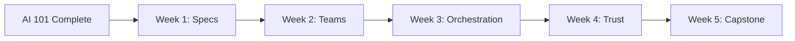

# Story: Course README And Curriculum Overview

## Priority / Epic

HIGH - AI 201 Advanced Claude Code

## Effort Estimate

3 story points

## Prerequisites / Dependencies

- Story 01 (Scaffold Course Directory Structure)

## Description

Create the main course `README.md` with the complete 5-week curriculum overview, learning path mermaid diagram, prerequisites (AI 101 required), track descriptions, quick start guide, and certification path.

### Tasks

1. **Course overview** — title, duration, level, format, goals
2. **Learning path diagram** — mermaid graph showing week progression
3. **Curriculum detail** — each week with objectives, agenda, key takeaways
4. **Track descriptions** — Developer, Architect, PM, QA with what each learns
5. **Prerequisites** — AI 101 completion required, plus technical requirements
6. **Quick start** — how to begin, sandbox workflow, getting help
7. **Certification path** — "AI Orchestrator" credential requirements
8. **References** — links to dx-claude-code skills, Anthropic docs, community resources
9. **Per-track technical prerequisites** — Include per-track technical prerequisites beyond AI 101 completion (e.g., tmux OPTIONAL for Agent Teams split-pane display mode, disk space for worktrees, Opus 4.6 model access). Note: Agent Teams default in-process mode works in any terminal with no extra tooling. tmux or iTerm2 only needed for split-pane display mode. Windows users: in-process mode works natively; split-pane mode with tmux requires WSL; split panes NOT supported in Windows Terminal or VS Code integrated terminal.
10. **Fast track option** — Consider an "Already using Agent Teams?" fast track for experienced users pointing to Weeks 3-5

## Acceptance Criteria

- [ ] `README.md` exists at course root with complete curriculum
- [ ] Mermaid diagram shows Week 1 → Week 5 progression
- [ ] AI 101 listed as prerequisite
- [ ] All 4 tracks described with role-specific learning outcomes
- [ ] Each week has objectives, agenda outline, and key takeaways
- [ ] Quick start section with sandbox workflow
- [ ] "AI Orchestrator" certification path documented
- [ ] dx-claude-code plugin skills referenced as teaching tools
- [ ] Follows AI 101 README patterns for consistency
- [ ] Per-track technical prerequisites documented

## Technical Details

### Key Sections

```markdown
# RealManage AI 201: Advanced Claude Code

## Choose Your Path (track table)
## Course Overview (duration, level, format)
## Learning Path (mermaid diagram)
## Course Structure (directory tree)
## Quick Start
## 5-Week Curriculum
  ### Week 1: Spec-Driven Development
  ### Week 2: Agent Teams
  ### Week 3: Multi-Agent Orchestration
  ### Week 4: Trust, Autonomy & Enterprise
  ### Week 5: Capstone
## Certification Path
## Prerequisites
  ### All Tracks
  ### Developer Track
  ### Architect Track
  ### PM Track
  ### QA Track
  ### Fast Track (Already using Agent Teams?)
## Resources
## Success Metrics
```

### Mermaid Diagram



### Through-Line Narrative

The "Orchestrator Mindset" is woven throughout:

- Week 1: Orchestrating specs (defining what agents will build)
- Week 2: Orchestrating teammates (coordinating agent work)
- Week 3: Orchestrating at scale (worktrees, pipelines, state)
- Week 4: Orchestrating trust (when to intervene, when to delegate)
- Week 5: Orchestrating everything (capstone project)

## Testing

1. Verify README renders correctly in GitLab
2. Verify mermaid diagram renders
3. Verify all internal links resolve
4. Compare format against AI 101 README for consistency
5. Verify prerequisites section is clear and complete
