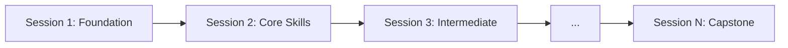

# [Course Name]: [Subtitle] 🚀

[Welcome paragraph describing the course purpose and transformation it will enable for RealManage teams]

## 📚 Course Overview

- **Duration:** [N] sessions (self-paced, ~2 hours per session)
- **Level:** [Beginner/Intermediate/Advanced]
- **Format:** Self-study with optional group sessions
- **Goal:** [Progressive immersion objective while leaving time for normal work]

## 🎯 What You'll Learn

By completing this course, you'll be able to:

- ✅ [Primary outcome with measurable skill]
- ✅ [Secondary outcome focusing on practical application]
- ✅ [Integration outcome with existing workflows]
- ✅ [Advanced technique or optimization]
- ✅ [RealManage-specific capability]
- ✅ [Quality/compliance standard (e.g., 80-90% test coverage)]

## 🗺️ Learning Path

<!-- Adjust nodes to match your course's session count and topics -->



## 📁 Course Structure

```text
[course-folder-name]/
├── .vscode/                     # IDE workspace settings
│   ├── extensions.json         # Recommended extensions
│   ├── settings.json           # Project settings
│   └── README.md               # IDE setup guide
├── exercises/                   # Shared practice materials
│   ├── prompts/                # Domain-specific templates
│   └── [exercise-files]
├── resources/                   # Reference materials
│   ├── cheatsheets/            # Quick reference guides
│   ├── prompts/                # Prompt templates
│   ├── troubleshooting.md     # Common issues & solutions
│   └── quick-reference.md     # Command reference
├── sessions/                    # Lessons with examples
│   ├── session-1/             # [Topic Name]
│   │   ├── example/            # Reference implementation (in git)
│   │   └── README.md           # Full lesson plan
│   ├── session-2/             # [Topic Name]
│   │   ├── example/            # Reference implementation (if applicable)
│   │   └── README.md
│   └── ... session-N
├── CLAUDE.md                    # AI context (if applicable)
└── README.md                    # You are here
```

## 🚀 Quick Start

### Option 1: Self-Paced Learning (Recommended)

1. **Complete Prerequisites** → Check the list below
2. **Start Session 1** → [Foundation & Setup](./sessions/session-1/README.md)
3. **Practice in Sandbox** → Copy examples to sandbox for hands-on work
4. **Track Progress** → Use the checklist at the bottom
5. **Get Help** → Join `#dx-training` on Slack

### 💡 Sandbox Workflow

Each session with code examples follows this pattern:

```bash
# Navigate to the session folder
cd sessions/session-X

# Copy the example to create your personal sandbox
cp -r example sandbox

# Enter your sandbox
cd sandbox

# Start your development environment
```

**Why this approach?**

- ✅ **Safe experimentation** - Break things without fear
- ✅ **Clean git history** - Your work won't be committed (sandbox is gitignored)
- ✅ **Easy reset** - Just delete sandbox and copy again
- ✅ **Reference available** - Original example stays pristine

### Option 2: Cohort Learning

Join a scheduled cohort for group learning:

- Weekly 2-hour sessions
- Live demonstrations
- Peer programming
- Direct Q&A with instructors

Check `#dx-training` for upcoming cohorts.

## 📋 Prerequisites Checklist

Before starting, ensure you have:

- [ ] **Development Environment**
  - [ ] [Required software/tools]
  - [ ] [Language runtimes/SDKs]
  - [ ] Git configured with GitLab access
  - [ ] IDE with recommended extensions

- [ ] **Accounts & Access**
  - [ ] [Required accounts]
  - [ ] GitLab account with RealManage access
  - [ ] Slack access to `#dx-training` channel

- [ ] **Basic Knowledge**
  - [ ] [Prerequisite skill 1]
  - [ ] [Prerequisite skill 2]
  - [ ] [Domain knowledge if applicable]

---

## 📖 Training Curriculum

<!-- Add or remove rows to match your course's session count -->

| Session | Topic | What You'll Learn | Time | Link |
| ------- | ----- | ----------------- | ---- | ---- |
| 1 | [Foundation Topic] | [Key skills, 1-2 phrases] | 2 hrs | [Start →](./sessions/session-1/README.md) |
| 2 | [Core Skills Topic] | [Key skills, 1-2 phrases] | 2 hrs | [Start →](./sessions/session-2/README.md) |
| 3 | [Intermediate Topic] | [Key skills, 1-2 phrases] | 2 hrs | [Start →](./sessions/session-3/README.md) |
| ... | ... | ... | ... | ... |
| N | [Capstone / Final Topic] | [Key skills, 1-2 phrases] | 2 hrs | [Start →](./sessions/session-N/README.md) |

> Each session README is self-contained with objectives, exercises, and role-specific tracks. Click "Start" to dive in.

### Example Session README Structure

Use this as a starting point for each session's `README.md`:

````markdown
# Session [N]: [Topic Name]

## 🎯 Objectives

By the end of this session, you'll be able to:

- [Measurable outcome 1]
- [Measurable outcome 2]
- [Measurable outcome 3]

## Agenda (2 hrs)

### 1. [Introduction / Review] (20 min)

- [Key concept overview]
- [Why this matters for RealManage]
- [Real-world applications]

### 2. [Core Content Block] (30 min)

- [Conceptual overview]
- [Step-by-step guide]
- [Practice exercises]

### 3. [Hands-On Workshop] (50 min)

- Copy the [Example](./example/) to your sandbox
- [Specific exercise description]
- [Expected outcomes]

### 4. [Deep Dive / Advanced] (10 min)

- [Extended concepts]
- [RealManage-specific patterns]

### 5. Reflection & Practice (10 min)

- Discuss takeaways
- Plan application to current work
- Share insights in Slack
````

---

## 🎓 Certification Path

Complete all sessions and submit a capstone project to earn:

- **RealManage [Course] Practitioner** certificate
- Recognition in Engineering All-Hands
- Badge for your GitLab profile
- Priority access to advanced courses

## 🤝 Getting Help

### Immediate Help

- **Quick Questions**: `#dx-training` on Slack
- **Bugs/Issues**: [GitLab Issues](https://gitlab.com/therealmanage/tools/dx/dx-training/-/issues)
- **Office Hours**: [Day/Time]

### Self-Help Resources

- [Troubleshooting Guide](./resources/troubleshooting.md)
- [Quick Reference](./resources/quick-reference.md)
- [Common Patterns](./resources/common-patterns.md)
- [Prompt Library](./resources/prompt-library.md) (if applicable)

## 📚 Follow-Up and Resources

### Official Documentation

- [Primary documentation with link]
- [Secondary resources]
- [Best practices guides]

### Internal Support

- Create `#[topic]-hackerspace` Slack channel
- Schedule weekly office hours
- Share libraries and templates

### Continued Learning

- Advanced topics: [List topics]
- Compare with other tools: [List alternatives]
- Explore automation opportunities

### Safety & Ethics

- [Relevant safety considerations]
- [Compliance requirements]
- [Data protection guidelines]
- [Best practices for production use]

## 🌟 Success Stories

> "[Quote from successful participant]" - *Role*

> "[Quote highlighting business impact]" - *Role*

> "[Quote about skill transformation]" - *Role*

## 📊 Success Metrics

You're ready for the next session when you can:

- [Measurable skill 1]
- [Measurable skill 2]
- [Measurable skill 3]
- [Measurable skill 4]
- [Measurable skill 5]

## 🚦 Red Flags

Seek help if:

- [Common issue 1]
- [Common issue 2]
- [Common issue 3]
- [Common issue 4]

---

## References

### Official Documentation

1. **[Resource Name]** - URL
2. **[Resource Name]** - URL
3. **[Resource Name]** - URL

### [Technology]-Specific Resources

1. **[Resource Name]** - URL
2. **[Resource Name]** - URL
3. **[Resource Name]** - URL

### Community Resources

1. **[Resource Name]** - URL
2. **[Resource Name]** - URL

### Additional Learning

1. **[Resource Name]** - URL
2. **[Resource Name]** - URL

---

**Questions?** Reach out in `#dx-training` or email <dx-team@realmanage.com>

*"[Inspirational quote about learning and growth at RealManage]"* - DX Team

---

## Template Usage Notes

When creating a new course using this template:

### Required Elements

1. **Replace all bracketed placeholders** with specific content
2. **Create session folders** with example code and a self-contained README
3. **Adjust the curriculum table** to match your session count (not locked to any duration)
4. **Include 3-5 objectives per session** mixing theory and practice
5. **Build progressively** - each session builds on previous learning
6. **End with a capstone** that consolidates all skills

### Folder Structure Requirements

```text
courses/[course-name]/
├── .vscode/               # IDE configuration
├── exercises/             # Shared exercises
├── resources/             # Reference materials
├── sessions/              # Session content
│   └── session-X/
│       ├── example/       # Reference code (in git)
│       └── README.md      # Lesson plan (use example above)
├── CLAUDE.md             # AI context (if using Claude Code)
└── README.md             # Main course document
```

### Content Guidelines

- **Prerequisites:** Be specific about tools and runtimes
- **Objectives:** Use measurable, action-oriented language
- **Exercises:** Always include hands-on practice in sandbox
- **Examples:** Use RealManage-specific scenarios (HOA, property management)
- **Resources:** Prioritize free, accessible documentation
- **Support:** Establish clear help channels

### Quality Checklist

Before launching a course:

- [ ] All links are valid and accessible
- [ ] Sandbox environments are tested
- [ ] Prerequisites list required tools and runtimes
- [ ] Time allocations are realistic
- [ ] Examples use RealManage scenarios
- [ ] Support channels are established
- [ ] Success metrics are measurable
- [ ] Certification criteria are clear

### RealManage Context

Always relate concepts to:

- HOA management workflows
- Property management systems
- Resident services
- Financial operations
- Compliance and reporting
- Test coverage targets (for development courses)
- Cross-functional collaboration
