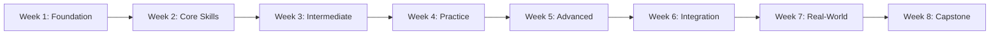

# [Course Name]: [Subtitle] 🚀

[Welcome paragraph describing the course purpose and transformation it will enable for RealManage teams]

## 📚 Course Overview

**Duration:** X weeks (self-paced, ~2 hours per week)  
**Level:** [Beginner/Intermediate/Advanced]  
**Format:** Self-study with optional group sessions  
**Goal:** [Progressive immersion objective while leaving time for normal work]

## 🎯 What You'll Learn

By completing this course, you'll be able to:
- ✅ [Primary outcome with measurable skill]
- ✅ [Secondary outcome focusing on practical application]
- ✅ [Integration outcome with existing workflows]
- ✅ [Advanced technique or optimization]
- ✅ [RealManage-specific capability]
- ✅ [Quality/compliance standard (e.g., 95% test coverage)]

## 🗺️ Learning Path



## 📁 Course Structure

```
[course-folder-name]/
├── .vscode/                     # IDE workspace settings
│   ├── extensions.json         # Recommended extensions
│   ├── settings.json           # Project settings
│   └── README.md               # IDE setup guide
├── exercises/                   # Shared practice materials
│   ├── prompts/                # Domain-specific templates
│   └── [exercise-files]
├── resources/                   # Reference materials
│   ├── cheatsheets/            # Quick reference guides
│   ├── prompts/                # Prompt templates
│   ├── troubleshooting.md     # Common issues & solutions
│   └── quick-reference.md     # Command reference
├── sessions/                    # Weekly lessons with examples
│   ├── week-1/                 # [Topic Name]
│   │   ├── example/            # Reference implementation (in git)
│   │   └── README.md           # Full lesson plan
│   ├── week-2/                 # [Topic Name]
│   │   ├── example/            # Reference implementation (if applicable)
│   │   └── README.md
│   └── ... weeks 3-8
├── CLAUDE.md                    # AI context (if applicable)
└── README.md                    # You are here
```

## 🚀 Quick Start

### Option 1: Self-Paced Learning (Recommended)

1. **Complete Prerequisites** → Check the list below
2. **Start Week 1** → [Foundation & Setup](./sessions/week-1/README.md)
3. **Practice in Sandbox** → Copy examples to sandbox for hands-on work
4. **Track Progress** → Use the checklist at the bottom
5. **Get Help** → Join `#dx-training` on Slack

### 💡 Sandbox Workflow

Each week with code examples follows this pattern:
```bash
# Navigate to the week's folder
cd sessions/week-X

# Copy the example to create your personal sandbox
cp -r example sandbox

# Enter your sandbox
cd sandbox

# Start your development environment
```

**Why this approach?**
- ✅ **Safe experimentation** - Break things without fear
- ✅ **Clean git history** - Your work won't be committed (sandbox is gitignored)
- ✅ **Easy reset** - Just delete sandbox and copy again
- ✅ **Reference available** - Original example stays pristine

### Option 2: Cohort Learning

Join a scheduled cohort for group learning:
- Weekly 2-hour sessions
- Live demonstrations
- Peer programming
- Direct Q&A with instructors

Check `#dx-training` for upcoming cohorts.

## 📋 Prerequisites Checklist

Before starting, ensure you have:

- [ ] **Development Environment**
  - [ ] [Required software/tools]
  - [ ] [Language runtimes/SDKs]
  - [ ] Git configured with GitLab access
  - [ ] IDE with recommended extensions

- [ ] **Accounts & Access**
  - [ ] [Required accounts]
  - [ ] GitLab account with RealManage access
  - [ ] Slack access to `#dx-training` channel

- [ ] **Basic Knowledge**
  - [ ] [Prerequisite skill 1]
  - [ ] [Prerequisite skill 2]
  - [ ] [Domain knowledge if applicable]

---

# 📖 8-Week Training Curriculum

## Week 1: [Foundation Topic]

### Objectives
- [Understand core concepts]
- [Set up development environment]
- [Complete first hands-on exercise]
- [Identify use cases for daily work]

### Agenda (2 hrs)

#### 1. [Introduction] (20 min)
- [Key concept overview]
- [Why this matters for RealManage]
- [Real-world applications]
- [Success stories]

#### 2. [Setup & Configuration] (30 min)
- [Step-by-step installation]
- [Configuration for RealManage environment]
- [Verification steps]
- [Common troubleshooting]

#### 3. [First Hands-On Exercise] (40 min)
- Copy the [Week 1 Example](./sessions/week-1/example/) to your sandbox
- [Specific exercise description]
- [Expected outcomes]
- [Common pitfalls to avoid]

#### 4. [Core Concept Deep Dive] (20 min)
- [Detailed explanation]
- [RealManage-specific examples]
- [Best practices]
- [Documentation references]

#### 5. Reflection & Practice (10 min)
- Discuss takeaways
- Plan application to current work
- Share insights in Slack

**[→ Full Week 1 Lesson](./sessions/week-1/README.md)**

---

## Week 2: [Core Skills Topic]

### Objectives
- [Build on Week 1 foundation]
- [Master fundamental techniques]
- [Apply to RealManage scenarios]

### Agenda (2 hrs)

#### 1. Review & Warm-up (15 min)
- Quick recap of Week 1
- Share practice experiences
- Address questions

#### 2. [Core Technique 1] (30 min)
- [Conceptual overview]
- [Step-by-step guide]
- [Practice exercises]

#### 3. [Core Technique 2] (30 min)
- [Advanced concepts]
- [RealManage applications]
- [Hands-on practice]

#### 4. Workshop: [Practical Application] (35 min)
- Break into pairs
- Work on RealManage scenarios
- Share solutions

#### 5. Next Steps (10 min)
- Homework assignments
- Resources for deeper learning

**[→ Week 2 Coming Soon](./sessions/week-2/README.md)**

---

## Week 3: [Intermediate Topic]

### Objectives
- [Advance beyond basics]
- [Integrate multiple concepts]
- [Solve complex problems]

### Agenda (2 hrs)

[Content structure similar to Week 2]

**[→ Week 3 Coming Soon](./sessions/week-3/README.md)**

---

## Week 4: [Practical Application]

### Objectives
- [Apply learned skills]
- [Build confidence through practice]
- [Prepare for advanced topics]

### Agenda (2 hrs)

[Content structure similar to Week 2]

**[→ Week 4 Coming Soon](./sessions/week-4/README.md)**

---

## Week 5: [Advanced Features]

### Objectives
- [Master advanced techniques]
- [Optimize workflows]
- [Implement best practices]

### Agenda (2 hrs)

[Content structure similar to Week 2]

**[→ Week 5 Coming Soon](./sessions/week-5/README.md)**

---

## Week 6: [Integration & Automation]

### Objectives
- [Integrate with existing systems]
- [Automate repetitive tasks]
- [Build custom solutions]

### Agenda (2 hrs)

[Content structure similar to Week 2]

**[→ Week 6 Coming Soon](./sessions/week-6/README.md)**

---

## Week 7: Real-World Scenarios

### Objectives
- [Apply to cross-functional tasks]
- [Support different team roles]
- [Implement continuous improvement]

### Agenda (2 hrs)

#### 1. Cross-Functional Use Cases (30 min)
- **Support staff:** [Specific applications]
- **Project managers:** [Specific applications]
- **Product managers:** [Specific applications]
- **Engineers:** [Specific applications]

#### 2. Group Exercise (60 min)
- Form cross-functional teams
- Apply all learned skills
- Build real RealManage features

#### 3. Iterate & Improve (20 min)
- Refine approaches
- Monitor metrics
- Setup automation

#### 4. Debrief (10 min)
- Share lessons learned

**[→ Week 7 Coming Soon](./sessions/week-7/README.md)**

---

## Week 8: Capstone Project

### Objectives
- Consolidate all skills
- Complete comprehensive project
- Present solutions
- Earn certification

### Agenda (2 hrs)

#### 1. Project Selection (10 min)
Teams choose from RealManage challenges:
- **Option A:** [Project description]
- **Option B:** [Project description]
- **Option C:** [Project description]
- **Option D:** Custom project (requires approval)

#### 2. Building (90 min)
Requirements for all projects:
- Apply all learned skills
- Document approach
- Include tests (95% coverage if applicable)
- Create presentation materials

#### 3. Demo & Celebration (20 min)
- Team presentations
- Peer feedback
- Instructor evaluation
- Celebration!

**[→ Week 8 Coming Soon](./sessions/week-8/README.md)**

---

## 📊 Track Your Progress

Use this checklist to track your journey:

- [ ] Week 1: [Topic] ✅
- [ ] Week 2: [Topic]
- [ ] Week 3: [Topic]
- [ ] Week 4: [Topic]
- [ ] Week 5: [Topic]
- [ ] Week 6: [Topic]
- [ ] Week 7: Real-World Scenarios
- [ ] Week 8: Capstone Project

## 🎓 Certification Path

Complete all 8 weeks and submit a capstone project to earn:
- **RealManage [Course] Practitioner** certificate
- Recognition in Engineering All-Hands
- Badge for your GitLab profile
- Priority access to advanced courses

## 🤝 Getting Help

### Immediate Help
- **Quick Questions**: `#dx-training` on Slack
- **Bugs/Issues**: [GitLab Issues](https://gitlab.com/therealmanage/tools/dx/dx-training/-/issues)
- **Office Hours**: [Day/Time]

### Self-Help Resources
- [Troubleshooting Guide](./resources/troubleshooting.md)
- [Quick Reference](./resources/quick-reference.md)
- [Common Patterns](./resources/common-patterns.md)
- [Prompt Library](./resources/prompt-library.md) (if applicable)

## 📚 Follow-Up and Resources

### Official Documentation
- [Primary documentation with link]
- [Secondary resources]
- [Best practices guides]

### Internal Support
- Create `#[topic]-hackerspace` Slack channel
- Schedule weekly office hours
- Share libraries and templates

### Continued Learning
- Advanced topics: [List topics]
- Compare with other tools: [List alternatives]
- Explore automation opportunities

### Safety & Ethics
- [Relevant safety considerations]
- [Compliance requirements]
- [Data protection guidelines]
- [Best practices for production use]

## 🌟 Success Stories

> "[Quote from successful participant]" - *Role*

> "[Quote highlighting business impact]" - *Role*

> "[Quote about skill transformation]" - *Role*

## 📊 Success Metrics

You're ready for the next week when you can:
- [Measurable skill 1]
- [Measurable skill 2]
- [Measurable skill 3]
- [Measurable skill 4]
- [Measurable skill 5]

## 🚦 Red Flags

Seek help if:
- [Common issue 1]
- [Common issue 2]
- [Common issue 3]
- [Common issue 4]

---

## References

### Official Documentation
1. **[Resource Name]** - URL
2. **[Resource Name]** - URL
3. **[Resource Name]** - URL

### [Technology]-Specific Resources
4. **[Resource Name]** - URL
5. **[Resource Name]** - URL
6. **[Resource Name]** - URL

### Community Resources
7. **[Resource Name]** - URL
8. **[Resource Name]** - URL

### Additional Learning
9. **[Resource Name]** - URL
10. **[Resource Name]** - URL

---

**Questions?** Reach out in `#dx-training` or email dx-team@realmanage.com

**Course Version:** 1.0.0 | **Last Updated:** [Date]

*"[Inspirational quote about learning and growth at RealManage]"* - DX Team

---

## Template Usage Notes

When creating a new course using this template:

### Required Elements
1. **Replace all bracketed placeholders** with specific content
2. **Create example folders** for each week's reference code
3. **Maintain 2-hour session structure** for consistency
4. **Include 3-5 objectives per session** mixing theory and practice
5. **Build progressively** - each session builds on previous learning
6. **End with capstone project** that consolidates all skills

### Folder Structure Requirements
```
courses/[course-name]/
├── .vscode/               # IDE configuration
├── exercises/             # Shared exercises
├── resources/             # Reference materials
├── sessions/              # Weekly content
│   └── week-X/
│       ├── example/       # Reference code (in git)
│       └── README.md      # Lesson plan
├── CLAUDE.md             # AI context (if using Claude Code)
└── README.md             # Main course document
```

### Content Guidelines
- **Prerequisites:** Be specific about versions and tools
- **Objectives:** Use measurable, action-oriented language
- **Exercises:** Always include hands-on practice in sandbox
- **Examples:** Use RealManage-specific scenarios (HOA, property management)
- **Resources:** Prioritize free, accessible documentation
- **Support:** Establish clear help channels

### Quality Checklist
Before launching a course:
- [ ] All links are valid and accessible
- [ ] Sandbox environments are tested
- [ ] Prerequisites include version numbers
- [ ] Time allocations are realistic
- [ ] Examples use RealManage scenarios
- [ ] Support channels are established
- [ ] Success metrics are measurable
- [ ] Certification criteria are clear

### RealManage Context
Always relate concepts to:
- HOA management workflows
- Property management systems
- Resident services
- Financial operations
- Compliance and reporting
- 95% test coverage (for development courses)
- Cross-functional collaboration

### Recommended Timeline
- **Weeks 1-2:** Foundation and basics
- **Weeks 3-4:** Core concepts and techniques  
- **Weeks 5-6:** Advanced features and integrations
- **Week 7:** Real-world application
- **Week 8:** Capstone project